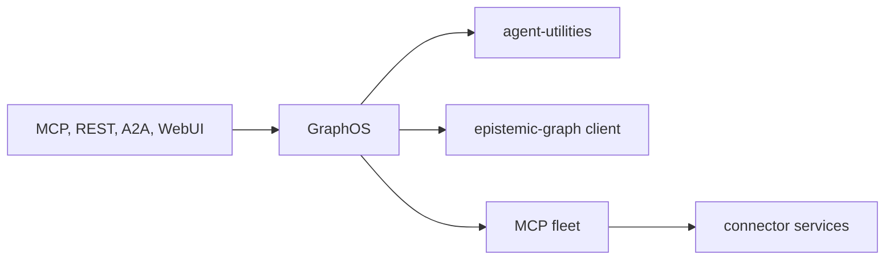

# GraphOS — repository guide

GraphOS is the deployable composition layer for the Knuckles agent platform.
This file defines its durable source boundaries and development rules. Public
operator documentation lives at <https://knuckles-team.github.io/graph-os/>.

## Source of truth

The repository owns the serving process and the code under `graph_os/`:

| Package | Responsibility |
|---|---|
| `graph_os.mcp_server` | MCP/REST composition, process authority, serving lifecycle, and shared action routing |
| `graph_os.fleet` | MCP child lifecycle, catalog discovery, OAuth admission, health, and per-session tool loading |
| `graph_os.gateway` | REST routes, dashboard aggregation, widget projection, and the host daemon |
| `graph_os.control_plane` | Fleet reconciliation and action-policy enforcement |
| `graph_os.webui_host` | Optional Agent WebUI co-service lifecycle |
| `graph_os.a2a` | Authenticated Agent Card and unary A2A projection |
| `graph_os.browser_control` | Governed browser catalog, lease, dispatch, and outcome orchestration |
| `graph_os.deployment` | Configuration, diagnostics, canaries, environment plans, and production operations |

The current capability limits are documented in `docs/status.md`. A capability
that is waiting on an upstream contract must fail closed and remain marked
unavailable; do not add a compatibility alias, static fallback, or fabricated
receipt to make it appear complete.

## Architecture boundary

GraphOS authenticates, composes, routes, supervises, and projects. It does not
own:

- durable graph data, RDF/OWL/SHACL semantics, graph query execution, proofs,
  or provenance — those belong to `epistemic-graph`;
- agent decisions, workflows, skills, or model-provider policy — those belong
  to `agent-utilities`;
- source-specific transport, paging, credential exchange, or writeback
  effects — those belong to `agent-connector-sdk` and connector services;
- browser-local UI state — that belongs to `agent-webui`.

Dependencies point toward those authorities through their public contracts.
Do not copy their implementations into this repository. Connector dashboard
widgets call admitted fleet tools; they never import vendor clients. MCP and
REST routes use the same application service and authorization decision.



## Entrypoints

The package publishes these console commands:

| Command | Purpose |
|---|---|
| `graph-os` | Serve the native MCP composition over `stdio` or `streamable-http` |
| `graph-os-daemon` | Run or inspect the consolidated graph host daemon |
| `setup-config` | Generate, validate, and describe deployment configuration |
| `agent-utilities-doctor` | Run deployment and dependency diagnostics |
| `agent-utilities-venv` | Inspect and reconcile managed runtime environments |
| `graph-os-release-canary` | Verify a candidate release against its declared catalog |
| `graph-os-production-ops` | Run guarded backup, restore, and production checks |

The `graph-os` entrypoint is `graph_os.mcp_server.server:mcp_server`. The serving
lifecycle owns one FastMCP event loop and one multiplexer instance. Co-services
submit work to that owner loop; they must not construct a second multiplexer or
block another loop on `Future.result()`.

## Configuration and security

- Resolve configuration through the shared XDG configuration model. Add an
  environment variable only when configuration cannot represent the setting.
- Commit examples with secret references only. Never commit credentials,
  bearer tokens, private endpoints, operator inventories, or generated live
  configuration.
- Network transports require server-validated identity, tenant isolation, and
  the configured TLS/authentication posture. Missing authority fails startup or
  the request; it never degrades to anonymous access.
- `stdio` stdout is protocol output. Application diagnostics go to logging or
  stderr, never `print()` from served packages.
- Preserve deterministic request identities, idempotency fences, bounded
  payloads, and privacy-safe receipts. A timeout or cancellation must not claim
  rollback when the external effect is unknown.
- Keep action-policy checks and durable provenance ahead of dispatch for
  governed mutations.

## Documentation

`README.md` is the concise public entry page. Detailed public material belongs
under `docs/` and is published with MkDocs. Keep prose about the current product
and its contracts; internal program history, local paths, temporary branch
names, and repository-transition notes belong outside this repository.

Build the site locally with:

```bash
uv run --no-project --with "mkdocs>=1.6,<2" mkdocs build --strict
```

Update `mkdocs.yml` whenever adding or removing a public page. Links in the
README must resolve either within this repository or to a public URL.

## Development setup

```bash
uv sync --extra test
uv run pytest
uv run ruff check .
uv run ruff format --check .
uv run mypy graph_os
```

For an implementation change, trace a real entrypoint through composition to
the owning service. A test that only imports a class is not wiring evidence.
When a behavior is exposed through both MCP and REST, change and test both in
the same commit.

The dependency graph, public package metadata, `uv.lock`, generated manifests,
and tests must agree. Change generated artifacts through their generator rather
than hand-editing them.

## Quality gates

Install the repository hooks once:

```bash
uvx --from pre-commit==4.6.0 pre-commit install --hook-type pre-commit --hook-type pre-push
```

Before committing, run the normal hooks over the files in the change. Before a
push or handoff, run the full local release evidence:

```bash
uvx --from pre-commit==4.6.0 pre-commit run --all-files
uvx --from pre-commit==4.6.0 pre-commit run pytest --hook-stage manual --all-files
uv run --no-project --with "mkdocs>=1.6,<2" mkdocs build --strict
uv build --wheel --out-dir dist
```

The pre-push suite also runs dependency readiness, scanner censuses, clone
checks, secret history, lock verification, and the local CI replica. Do not
bypass a failing gate, add an inline suppression, freeze a baseline, or weaken
a threshold to make a change pass. The scanner acceptance policy is documented
in `docs/quality-gate-terms.md`.

The shared hooks come from `Knuckles-Team/pipelines` at the immutable revision
in `.pre-commit-config.yaml`. CI must run the same revision. On a development
host where that revision is not published, use a command-local Git URL rewrite
to the reviewed local pipelines checkout; never mutate repository or global Git
configuration for the workaround.

## Branching and shared-worktree safety

Work in a dedicated Git worktree created from the current local `main`:

```bash
git worktree add "${XDG_STATE_HOME}/repository-worktrees/graph-os/<lane>" \
  -b "<type>/<lane>" main
```

- Never use an orchestration tool's automatic worktree isolation against this
  shared checkout. It can mutate `core.bare` in the common Git directory.
- Never use `git stash`; all linked worktrees share one `refs/stash`.
- Never stage with `git add .` or `git add -A`.
- Inspect `git status --short` and the complete diff, then stage an explicit
  allowlist of reviewed paths.
- Re-read `git diff --cached --name-status` and `git diff --cached` before every
  commit.
- Do not commit logs, caches, reports, generated site output, scratch files,
  local configuration, or handoff notes.
- Preserve unrelated changes. Do not reset, revert, delete, merge, push, tag,
  or publish another lane's work without explicit ownership.

## Delivery checklist

1. Confirm the change belongs to GraphOS and identify its public entrypoint.
2. Update the single owning implementation; do not add a parallel fallback.
3. Prove live wiring and MCP/REST parity where applicable.
4. Update the status and public documentation without overstating availability.
5. Run focused tests, then the applicable full gates.
6. Inspect and stage only the reviewed path allowlist.
7. Commit with a descriptive message and report the commit and verification
   evidence. Push, tag, release, and deploy only when explicitly requested.
