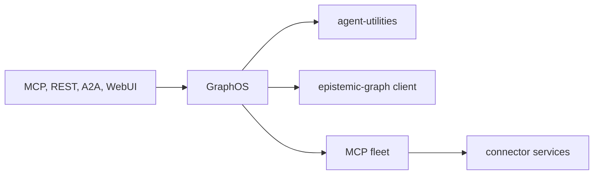

# GraphOS — repository guide

GraphOS is the deployable composition layer for the Knuckles agent platform.
This file defines its durable source boundaries and development rules. Public
operator documentation lives at <https://knuckles-team.github.io/graph-os/>.

## What this repository owns

This repository owns the GraphOS serving process and the code under
`graph_os/`: MCP and REST composition, MCP fleet supervision, control-plane
policy, optional Agent WebUI hosting, unary A2A, governed browser control, and
deployment operations.

Current capability limits are documented in `docs/status.md`. A capability
waiting on another repository's public contract must fail closed and remain
marked unavailable. Do not add a compatibility alias, static fallback, or
fabricated receipt to make it appear complete.

## Architecture and module map

| Package | Responsibility |
|---|---|
| `graph_os.mcp_server` | MCP/REST composition, process authority, serving lifecycle, and shared action routing |
| `graph_os.fleet` | MCP child lifecycle, catalog discovery, OAuth admission, health, and per-session tool loading |
| `graph_os.gateway` | REST routes, dashboard aggregation, widget projection, and the host daemon |
| `graph_os.control_plane` | Fleet reconciliation and action-policy enforcement |
| `graph_os.webui_host` | Optional Agent WebUI co-service lifecycle |
| `graph_os.a2a` | Authenticated Agent Card and unary A2A projection |
| `graph_os.browser_control` | Governed browser catalog, lease, dispatch, and outcome orchestration |
| `graph_os.deployment` | Configuration, diagnostics, canaries, environment plans, and production operations |

GraphOS authenticates, composes, routes, supervises, and projects. Durable
graph state and RDF/OWL/SHACL semantics belong to `epistemic-graph`; agent
decisions and workflows belong to `agent-utilities`; source-specific transport
and effects belong to `agent-connector-sdk` and connector services; browser
presentation belongs to `agent-webui`.

Dependencies point toward those authorities through public contracts. Do not
copy their implementations here. Connector widgets invoke admitted fleet tools
instead of importing vendor clients. MCP and REST routes share the same
application service and authorization decision.



The serving lifecycle owns one FastMCP event loop and one multiplexer instance.
Co-services submit work to that owner loop; they must not construct a second
multiplexer or block another loop on `Future.result()`.

Security is fail closed:

- Resolve settings through the shared XDG configuration model. Add an
  environment variable only when configuration cannot express the value.
- Never commit credentials, bearer tokens, private endpoints, operator
  inventories, generated live configuration, or plaintext secrets.
- Network transports require validated identity, tenant isolation, and the
  configured TLS and authorization posture.
- `stdio` stdout is protocol output; diagnostics use logging or stderr.
- Preserve deterministic request identities, idempotency fences, bounded
  payloads, and privacy-safe receipts. Unknown effects never claim rollback.
- Apply action policy and durable provenance before governed mutation dispatch.

## Commands

The package publishes these operator commands:

| Command | Purpose |
|---|---|
| `graph-os` | Serve the native MCP composition over `stdio` or `streamable-http` |
| `graph-os-daemon` | Run or inspect the consolidated graph host daemon |
| `setup-config` | Generate, validate, and describe deployment configuration |
| `agent-utilities-doctor` | Run deployment and dependency diagnostics |
| `agent-utilities-venv` | Inspect and reconcile managed runtime environments |
| `graph-os-release-canary` | Verify a candidate release and catalog |
| `graph-os-production-ops` | Run guarded backup, restore, and production checks |

The `graph-os` entrypoint is `graph_os.mcp_server.server:mcp_server`.

Install and run focused development checks with:

```bash
uv sync --extra test
uv run pytest
uv run ruff check .
uv run ruff format --check .
uv run mypy graph_os
```

## Quality gates

Install the repository hooks once:

```bash
uvx --from pre-commit==4.6.0 pre-commit install \
  --hook-type pre-commit --hook-type pre-push
```

Run the normal hooks and release evidence before handoff:

```bash
uvx --from pre-commit==4.6.0 pre-commit run --all-files
uvx --from pre-commit==4.6.0 pre-commit run pytest --hook-stage manual --all-files
uv run --no-project --with "mkdocs>=1.6,<2" mkdocs build --strict
uv build --wheel --out-dir dist
```

The pre-push suite adds dependency readiness, scanner censuses, clone checks,
secret history, lock verification, and the local CI replica. Do not bypass a
failure, add an inline suppression, freeze a baseline, or weaken a threshold.
Scanner acceptance rules live in `docs/quality-gate-terms.md`.

Shared hooks come from `Knuckles-Team/pipelines` at the immutable revision in
`.pre-commit-config.yaml`; CI and local checks use that same revision. A local
checkout substitution must be command-local and must never mutate repository
or global Git configuration.

## Development rules

- Confirm that a change belongs to GraphOS and identify its public entrypoint.
- Update the single owning implementation; do not add a parallel fallback.
- Trace a real entrypoint through composition to its owning service. A test
  that only imports a class is not wiring evidence.
- Change and test MCP and REST together when both expose the behavior.
- Keep package metadata, `uv.lock`, generated manifests, and tests consistent.
  Regenerate derived artifacts rather than editing them by hand.
- Preserve fail-closed authority checks, deterministic effects, and tenant
  isolation.
- Update current public status without overstating availability.
- Run focused tests first, then every applicable full gate.
- Stage only an explicit reviewed path allowlist and inspect the staged diff.
- Push, tag, publish, and deploy only when explicitly requested.

## Documentation

`README.md` is the concise public entry page. Detailed public material belongs
under `docs/` and is published with MkDocs. Keep prose about the current
product and its contracts. Internal planning history, local paths, temporary
branches, and repository-transition notes do not belong on the public surface.

Build the site with:

```bash
uv run --no-project --with "mkdocs>=1.6,<2" mkdocs build --strict
```

Update `mkdocs.yml` when adding or removing a page. README links must resolve
within the repository or to a public URL.

## Branching & isolation

Work in a dedicated Git worktree created from current local `main`:

```bash
git worktree add "${XDG_STATE_HOME}/repository-worktrees/graph-os/<lane>" \
  -b "<type>/<lane>" main
```

- Never use an orchestration tool's automatic worktree isolation against this
  shared checkout; it can mutate `core.bare` in the common Git directory.
- Never use `git stash`; linked worktrees share one `refs/stash`.
- Never stage with `git add .` or `git add -A`.
- Inspect `git status --short`, stage explicit paths, then re-read
  `git diff --cached --name-status` and `git diff --cached`.
- Do not commit logs, caches, reports, generated sites, scratch files, local
  configuration, or handoff notes.
- Preserve unrelated work. Do not reset, revert, delete, merge, push, tag, or
  publish another lane's changes without explicit ownership.
