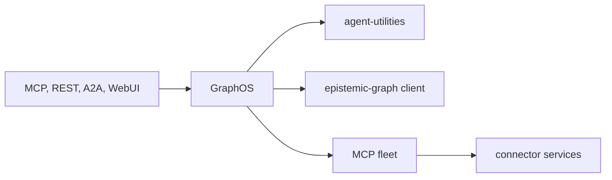

# GraphOS — repository guide

GraphOS is the deployable composition layer for the Knuckles agent platform.
This file defines its durable source boundaries and development rules. Public
operator documentation lives at <https://knuckles-team.github.io/graph-os/>.

## What this repository owns

This repository owns the GraphOS serving process and the code under
`graph_os/`: MCP and REST composition, MCP fleet supervision, control-plane
policy, optional Agent WebUI hosting, unary A2A, governed browser control, and
deployment operations.

Current capability limits are documented in `docs/status.md`. A capability
waiting on another repository's public contract must fail closed and remain
marked unavailable. Do not add a compatibility alias, static fallback, or
fabricated receipt to make it appear complete.

## Architecture and module map

| Package | Responsibility |
|---|---|
| `graph_os.mcp_server` | MCP/REST composition, process authority, serving lifecycle, and shared action routing |
| `graph_os.fleet` | MCP child lifecycle, catalog discovery, OAuth admission, health, and per-session tool loading |
| `graph_os.gateway` | REST routes, dashboard aggregation, widget projection, and the host daemon |
| `graph_os.control_plane` | Fleet reconciliation and action-policy enforcement |
| `graph_os.webui_host` | Optional Agent WebUI co-service lifecycle |
| `graph_os.a2a` | Authenticated Agent Card and unary A2A projection |
| `graph_os.browser_control` | Governed browser catalog, lease, dispatch, and outcome orchestration |
| `graph_os.deployment` | Configuration, diagnostics, canaries, environment plans, and production operations |

GraphOS authenticates, composes, routes, supervises, and projects. Durable
graph state and RDF/OWL/SHACL semantics belong to `epistemic-graph`; agent
decisions and workflows belong to `agent-utilities`; source-specific transport
and effects belong to `agent-connector-sdk` and connector services; browser
presentation belongs to `agent-webui`.

Dependencies point toward those authorities through public contracts. Do not
copy their implementations here. Connector widgets invoke admitted fleet tools
instead of importing vendor clients. MCP and REST routes share the same
application service and authorization decision.


```mermaid
flowchart LR
    Clients["MCP, REST, A2A, WebUI"] --> GraphOS["GraphOS"]
    GraphOS --> Agents["agent-utilities"]
    GraphOS --> EG["epistemic-graph client"]
    GraphOS --> Fleet["MCP fleet"]
    Fleet --> Sources["connector services"]
```

The serving lifecycle owns one FastMCP event loop and one multiplexer instance.
Co-services submit work to that owner loop; they must not construct a second
multiplexer or block another loop on `Future.result()`.

Security is fail closed:

- Resolve settings through the shared XDG configuration model. Add an
  environment variable only when configuration cannot express the value.
- Never commit credentials, bearer tokens, private endpoints, operator
  inventories, generated live configuration, or plaintext secrets.
- Network transports require validated identity, tenant isolation, and the
  configured TLS and authorization posture.
- `stdio` stdout is protocol output; diagnostics use logging or stderr.
- Preserve deterministic request identities, idempotency fences, bounded
  payloads, and privacy-safe receipts. Unknown effects never claim rollback.
- Apply action policy and durable provenance before governed mutation dispatch.

## Setup

From a fresh clone (locally, or in a Claude Code cloud session where
`.claude/hooks/session-start.sh` runs it automatically):

```bash
scripts/bootstrap.sh              # uv >= 0.9, pinned Python, sibling sources, locked deps, git hooks
scripts/bootstrap.sh --kernel     # also build epistemic-graph's numeric kernel (needed by the full suite)
scripts/bootstrap.sh --scanners   # also the pinned cccc/kiss/dupehound/jscpd scanners (~15 min cold)
```

Bootstrap is idempotent. It links each `[tool.uv.sources]` path under
`.uv-workspace-siblings/` to a `../<repository>` checkout when one exists (the
layout in `graph_os/skills/graph-os-development/references/bootstrap.md`) and
installs the pre-commit and pre-push hooks. A hook whose prerequisite is
missing (a sibling checkout, the synced environment, the kernel) prints
`SKIPPED (<gate>): <reason>` and exits 0 locally; under CI (`$CI` set) it
exits 2 with `CANNOT RUN`, so hosted CI never passes a gate that did not run.

## Commands

The package publishes these operator commands:

| Command | Purpose |
|---|---|
| `graph-os` | Serve the native MCP composition over `stdio` or `streamable-http` |
| `graph-os-daemon` | Run or inspect the consolidated graph host daemon |
| `setup-config` | Generate, validate, and describe deployment configuration |
| `agent-utilities-doctor` | Run deployment and dependency diagnostics |
| `agent-utilities-venv` | Inspect and reconcile managed runtime environments |
| `graph-os-release-canary` | Verify a candidate release and catalog |
| `graph-os-production-ops` | Run guarded backup, restore, and production checks |

The `graph-os` entrypoint is `graph_os.mcp_server.server:mcp_server`.

After `scripts/bootstrap.sh`, run focused development checks with:

```bash
uv run --no-sync pytest tests/<area>
uv run --no-sync ruff check .
uv run --no-sync mypy graph_os
```

## Quality gates

`.pre-commit-config.yaml` is the single definition of the gates. The release
workflow runs it directly: the commit stage over every file, the push stage
over the pushed range, then the manual-stage `mypy-env` and `pytest` hooks
once the pinned sibling sources and source-overlay environment are provisioned.
Run the same locally:

```bash
uvx pre-commit run --all-files
uvx pre-commit run --hook-stage pre-push --all-files
uvx pre-commit run mypy-env --hook-stage manual --all-files
uvx pre-commit run pytest --hook-stage manual --all-files
uv run --no-project --with "mkdocs>=1.6,<2" mkdocs build --strict
uv build --wheel --out-dir dist
```

The scanner job provisions the exact native scanner versions with
`scripts/install_scanners.sh` (also `scripts/bootstrap.sh --scanners`) and
blocks on any census finding. On release tags, repository-manager's
external-index `dependency-readiness` hook blocks build and publication. The
`uv-lock` and scanner census hooks remain available at the `manual` stage. Do
not bypass a failure, add an inline suppression, freeze a baseline, or weaken
a threshold; gates check behaviour or a contract derived from its source of
truth, never a hand-kept count, pin copy or golden digest. Scanner acceptance
rules live in `docs/quality-gate-terms.md`.

Shared hooks come from `Knuckles-Team/pipelines` at `main` — the one sanctioned
exception to this repository's immutable-pin policy, so pipeline fixes land
automatically; every reference in `.pre-commit-config.yaml` and the GitHub
Actions workflows names the default branch, never a commit or tag. A local
checkout substitution must be command-local and must never mutate repository
or global Git configuration.

### Orphan-module wiring gate (Python)

`scripts/check_wiring.py orphans` (the `check-orphan-modules` pre-commit
hook) is this repository's Python wiring gate: a tracked module under
`graph_os/` fails when it has neither production fan-in (nothing in the
package imports it) nor production fan-out (it imports nothing from the
package), and is not a declared root (the top-level `graph_os` package or a
`[project.scripts]` / `[project.entry-points]` target). A dynamically
dispatched module — for example `graph_os.gateway.registry`'s string-keyed
widget loader — is not an orphan as long as it imports something from the
package itself (every widget imports its shared `base` module), matching
this gate's structural, not reachability, definition. There is no allowlist:
an isolated module is wired in, reached by another module, or deleted. This
restores the semantics `kiss check`'s own `orphan_module_enabled` provided
before kiss 0.4.11 moved orphan detection to the coverage-linked `kiss test`
(see `.config/kiss.toml`).

## Development rules

- Confirm that a change belongs to GraphOS and identify its public entrypoint.
- Update the single owning implementation; do not add a parallel fallback.
- Trace a real entrypoint through composition to its owning service. A test
  that only imports a class is not wiring evidence.
- Change and test MCP and REST together when both expose the behavior.
- Keep package metadata, `uv.lock`, generated manifests, and tests consistent.
  Regenerate derived artifacts rather than editing them by hand.
- Preserve fail-closed authority checks, deterministic effects, and tenant
  isolation.
- Update current public status without overstating availability.
- Run focused tests first, then every applicable full gate.
- Stage only an explicit reviewed path allowlist and inspect the staged diff.
- Push, tag, publish, and deploy only when explicitly requested.

## Documentation

`README.md` is the concise public entry page. Detailed public material belongs
under `docs/` and is published with MkDocs. Keep prose about the current
product and its contracts. Internal planning history, local paths, temporary
branches, and repository-transition notes do not belong on the public surface.

Build the site with:

```bash
uv run --no-project --with "mkdocs>=1.6,<2" mkdocs build --strict
```

Update `mkdocs.yml` when adding or removing a page. README links must resolve
within the repository or to a public URL.

## Branching & isolation

Never push to `main`. Work on a topic branch from current `origin/main`, in a
dedicated Git worktree when other work shares the checkout:

```bash
git fetch origin
git worktree add "${XDG_STATE_HOME}/repository-worktrees/graph-os/<lane>" \
  -b "<type>/<lane>" origin/main
```

Commit in logical steps, push the branch with `git push -u origin <branch>`,
and open a draft pull request against `main`; hosted CI (`release.yml`) is the
merge gate.

- Never use an orchestration tool's automatic worktree isolation against this
  shared checkout; it can mutate `core.bare` in the common Git directory.
- Never use `git stash`; linked worktrees share one `refs/stash`.
- Never stage with `git add .` or `git add -A`.
- Inspect `git status --short`, stage explicit paths, then re-read
  `git diff --cached --name-status` and `git diff --cached`.
- Do not commit logs, caches, reports, generated sites, scratch files, local
  configuration, or handoff notes.
- Preserve unrelated work. Do not reset, revert, delete, merge, push, tag, or
  publish another lane's changes without explicit ownership.
