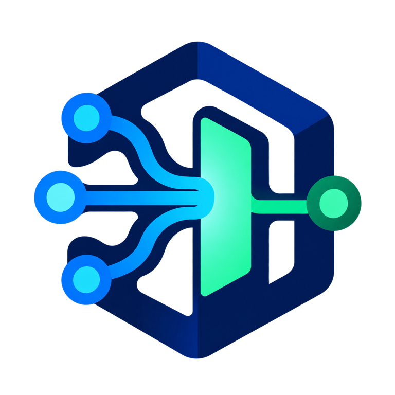

# Graph OS

<p align="center">
  
</p>

<p align="center">
  <strong>The process you run to open the Knuckles agent platform.</strong><br>
  <sub>MCP · REST · A2A · identity policy · fleet supervision · hosted interfaces</sub>
</p>

<p align="center">

[](https://pypi.org/project/graph-os/)
[](https://github.com/Knuckles-Team/graph-os/actions/workflows/release.yml)
[](https://knuckles-team.github.io/graph-os/)
[](https://github.com/Knuckles-Team/graph-os)
[](https://github.com/Knuckles-Team/graph-os/stargazers)
[](https://github.com/Knuckles-Team/graph-os/forks)
[](https://github.com/Knuckles-Team/graph-os/graphs/contributors)
[](LICENSE)
[](https://github.com/Knuckles-Team/graph-os/commits/main)
[](https://github.com/Knuckles-Team/graph-os/pulls)
[](https://github.com/Knuckles-Team/graph-os/pulls?q=is%3Apr+is%3Aclosed)
[](https://github.com/Knuckles-Team/graph-os/issues)
[](https://github.com/Knuckles-Team/graph-os)
[](https://github.com/Knuckles-Team/graph-os)
[](https://github.com/Knuckles-Team/graph-os)
[](https://github.com/Knuckles-Team/graph-os)
[](https://pypi.org/project/graph-os/)
[](https://pypi.org/project/graph-os/)
[](https://pypi.org/project/graph-os/)
[](https://pypi.org/project/graph-os/)

</p>

<p align="center">
  <a href="https://knuckles-team.github.io/graph-os/">Documentation</a> ·
  <a href="https://knuckles-team.github.io/graph-os/capabilities/">Capabilities</a> ·
  <a href="https://knuckles-team.github.io/graph-os/interfaces/">Interfaces</a> ·
  <a href="https://knuckles-team.github.io/graph-os/status/">Status</a>
</p>

## Overview

Run Graph OS when an MCP client, HTTP application, A2A peer, or hosted interface
needs one authenticated way into the platform. One serving lifecycle composes
the same application services across transports, applies identity and tenant
policy, and keeps tool discovery tied to the live fleet catalog.

Graph OS is the platform edge and composition root. It is not the agent harness,
the durable database, a connector implementation, or the browser UI.

## Key Capabilities

- Serve local MCP over `stdio` and authenticated MCP over streamable HTTP.
- Project the same governed operations through REST and unary A2A.
- Discover, admit, supervise, and route the MCP connector fleet.
- Apply identity, tenant, action-policy, idempotency, and provenance controls.
- Host Agent Web UI and coordinate terminal, desktop, messaging, and attended
  browser capabilities.
- Generate deployment configuration and report live readiness through `/health`.

## Documentation

Start with the **[visual platform guide](https://knuckles-team.github.io/graph-os/)**,
then use the task-oriented references:

- [Start Graph OS](https://knuckles-team.github.io/graph-os/get-started/)
- [Review capabilities](https://knuckles-team.github.io/graph-os/capabilities/)
- [Choose an interface](https://knuckles-team.github.io/graph-os/interfaces/)
- [Understand the architecture](https://knuckles-team.github.io/graph-os/architecture/)
- [Check live status](https://knuckles-team.github.io/graph-os/status/)
- [Configure a deployment](https://knuckles-team.github.io/graph-os/deployment/)

## Architecture

| Layer | Authority | Relationship to Graph OS |
|---|---|---|
| [Agent Web UI](https://knuckles-team.github.io/agent-webui/) | Browser experience and local interaction state | Graph OS hosts it and supplies governed application routes. |
| Agent Terminal UI | Terminal and headless interaction | Uses the governed Graph OS REST interface. |
| Geniusbot | Desktop cockpit | Uses the governed Graph OS gateway for its primary panels. |
| Messaging channels | Chat and voice entrypoints | Graph OS hosts and supervises them; agent-utilities owns adapters and routing. |
| **Graph OS** | MCP, REST, A2A, identity policy, fleet supervision | The running process and public door. |
| [agent-utilities](https://knuckles-team.github.io/agent-utilities/) | Agents, workflows, evaluation, and skills | Graph OS invokes its typed control-plane services. |
| [epistemic-graph](https://knuckles-team.github.io/epistemic-graph/) | Durable graph, SQL, RDF, vector, time, reasoning, and provenance | Graph OS uses its generated client contracts. |
| [agent-connector-sdk](https://knuckles-team.github.io/agent-connector-sdk/) | Connector servers, source synchronization, and governed effects | Graph OS discovers and routes SDK-based connector services. |

The boundary is deliberate: Graph OS authenticates, composes, routes,
supervises, and projects. Each sibling remains the source of truth for its own
domain.


## Quick Start

Requires Python 3.12–3.14 and [`uv`](https://docs.astral.sh/uv/). Install the
bundled runtime, generate the local profile, and register its `stdio` launcher
with Codex:

```bash
uv tool install "graph-os[webui]"
setup-config generate --profile tiny
setup-config doctor --profile tiny
setup-config codex
```

The doctor command is the first observable result: it reports whether the local
profile and required authorities are ready before a listener starts. Graph OS
then appears as the `graph-os` MCP server in Codex. Other MCP clients can
launch the same local transport directly:

```bash
graph-os --transport stdio
```

Network deployments use the identity, TLS, and authorization settings in the
[deployment guide](https://knuckles-team.github.io/graph-os/deployment/).

## Contributing

Issues and pull requests are welcome. Read [AGENTS.md](AGENTS.md) for source
boundaries and quality gates. Report vulnerabilities through
[GitHub Security Advisories](https://github.com/Knuckles-Team/graph-os/security/advisories/new).

### Development

Create a branch, install the `test` extra, and run the focused tests plus
repository hooks described in [AGENTS.md](AGENTS.md).

## License

Graph OS is released under the [MIT License](LICENSE).
