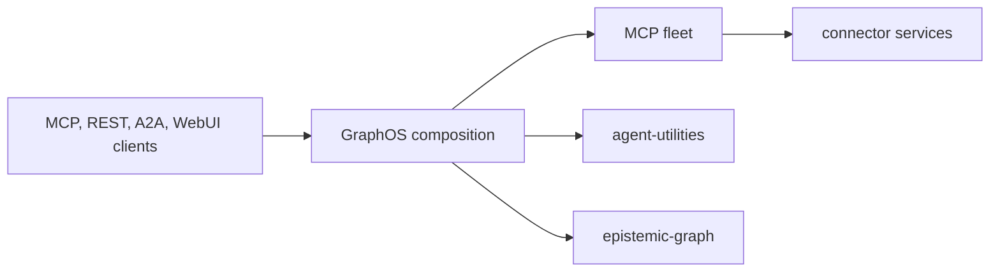

# GraphOS

[](https://pypi.org/project/graph-os/)
[](https://github.com/Knuckles-Team/graph-os)
[](https://pypi.org/project/graph-os/)
[](https://github.com/Knuckles-Team/graph-os/stargazers)
[](https://github.com/Knuckles-Team/graph-os/forks)
[](https://github.com/Knuckles-Team/graph-os/graphs/contributors)
[](https://pypi.org/project/graph-os/)
[](LICENSE)
[](https://github.com/Knuckles-Team/graph-os/commits/main)
[](https://github.com/Knuckles-Team/graph-os/pulls)
[](https://github.com/Knuckles-Team/graph-os/pulls?q=is%3Apr+is%3Aclosed)
[](https://github.com/Knuckles-Team/graph-os/issues)
[](https://github.com/Knuckles-Team/graph-os)
[](https://github.com/Knuckles-Team/graph-os)
[](https://github.com/Knuckles-Team/graph-os)
[](https://github.com/Knuckles-Team/graph-os)
[](https://pypi.org/project/graph-os/)
[](https://pypi.org/project/graph-os/)
[](https://github.com/Knuckles-Team/graph-os/actions/workflows/release.yml)
[](https://knuckles-team.github.io/graph-os/)

GraphOS is the deployable composition layer for the Knuckles agent platform. It
hosts the MCP and REST boundaries, supervises the dynamic MCP fleet, applies
control-plane policy, serves Agent WebUI, and provides deployment and health
tooling around the agent and graph services.

It is intentionally a composition layer—not a second knowledge engine, agent
harness, or connector implementation.

## What GraphOS owns

- A native MCP server with `stdio` and authenticated `streamable-http`
  transports.
- REST routing over the same application services used by MCP.
- Dynamic MCP fleet discovery, lifecycle, authorization, and tool loading.
- Control-plane reconciliation and action-policy enforcement.
- Optional Agent WebUI co-hosting.
- Unary A2A send, get, list, cancel, and Agent Card surfaces.
- Governed browser-control orchestration.
- Configuration generation, diagnostics, release canaries, and production
  operations.

GraphOS delegates durable graph, RDF, OWL, SHACL, query, proof, and provenance
operations to
[epistemic-graph](https://github.com/Knuckles-Team/epistemic-graph). Agent
workflows remain in
[agent-utilities](https://github.com/Knuckles-Team/agent-utilities), while
source-specific transport belongs to
[agent-connector-sdk](https://github.com/Knuckles-Team/agent-connector-sdk).

## Status

GraphOS is currently version `0.1.0` and is classified as pre-alpha. Its main
runtime packages are implemented and tested, but several capabilities depend
on contracts that are still being completed in adjacent repositories. Those
paths fail closed instead of using a compatibility fallback or claiming a
successful operation.

In particular, the EG-backed fleet catalog read, durable four-family catalog
reconciliation, and A2A budget-selected tool subset are not yet generally
available. See the [capability status](https://knuckles-team.github.io/graph-os/status/)
for the exact boundaries.

## Install

GraphOS requires Python 3.12 through 3.14.

```bash
python -m pip install graph-os
```

Install the optional WebUI host integration with:

```bash
python -m pip install "graph-os[webui]"
```

The package may not be visible on PyPI until its first release is published;
the PyPI badges above will populate automatically after publication.

## Configure

Generate a complete local profile and validate it before serving:

```bash
setup-config generate --profile tiny
setup-config doctor --profile tiny
```

Configuration follows the XDG directories and stores secrets by reference,
not as plaintext in repository files. Available profiles and deployment
commands are covered in the
[deployment guide](https://knuckles-team.github.io/graph-os/deployment/).

## Run as an MCP server

For a local MCP client, serve GraphOS over standard input/output:

```bash
graph-os --transport stdio
```

An MCP client can launch the same command directly:

```json
{
  "mcpServers": {
    "graph-os": {
      "command": "graph-os",
      "args": ["--transport", "stdio"]
    }
  }
}
```

For a network deployment, use the authenticated HTTP transport and bind it
behind the deployment's identity and TLS policy:

```bash
graph-os --transport streamable-http --host 127.0.0.1 --port 8000
```

Network serving fails closed when the required identity configuration is not
present. Do not expose an unauthenticated development listener publicly.

## Architecture



The dependency direction is deliberate:

1. GraphOS authenticates, composes, routes, and supervises.
2. `agent-utilities` owns agent decisions and workflows.
3. `agent-connector-sdk` and connector services own external-system effects.
4. `epistemic-graph` owns durable semantic state and reasoning.
5. UIs consume GraphOS; they do not become an authority for graph or policy
   state.

MCP and REST routes share application services. Fleet tools are loaded from an
authorized catalog and run under the same verified session context. Missing
authority, catalog convergence, or upstream capability is an error—not a
signal to fall back to static or process-local state.

## Documentation

The complete documentation is published at
[knuckles-team.github.io/graph-os](https://knuckles-team.github.io/graph-os/):

- [Capability status](https://knuckles-team.github.io/graph-os/status/)
- [MCP server](https://knuckles-team.github.io/graph-os/mcp-server/)
- [REST gateway](https://knuckles-team.github.io/graph-os/gateway/)
- [Fleet gateway](https://knuckles-team.github.io/graph-os/fleet/)
- [Unary A2A](https://knuckles-team.github.io/graph-os/a2a/)
- [Governed browser control](https://knuckles-team.github.io/graph-os/browser-control-service/)
- [Deployment and configuration](https://knuckles-team.github.io/graph-os/deployment/)

## Development

```bash
git clone https://github.com/Knuckles-Team/graph-os.git
cd graph-os
uv sync --extra test
uv run pytest
uv run --no-project --with "mkdocs>=1.6,<2" mkdocs build --strict
```

Before contributing, read [AGENTS.md](AGENTS.md) for the repository boundaries,
quality gates, and safe multi-worktree workflow. Changes should keep MCP and
REST behavior aligned, preserve fail-closed authority checks, and include tests
that prove the live composition path.

## Contributing

Issues and pull requests are welcome. Please keep changes within GraphOS's
composition boundary and run the relevant tests and pre-commit gates before
opening a pull request. Security-sensitive reports should use GitHub's private
security reporting rather than a public issue.

## License

GraphOS is released under the [MIT License](LICENSE).
