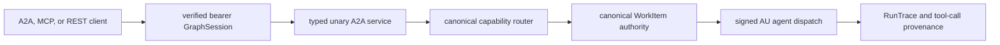

# Unary A2A facade

GraphOS exposes one authenticated, unary-only A2A boundary over the existing
agent-utilities WorkItem and signed agent-dispatch authorities. It does not
create an A2A-specific task database, broker, worker, or orchestration loop.

## Discovery and transports

The authenticated Agent Card is served at
`/.well-known/agent-card.json`. The obsolete `/.well-known/agent.json` path is
not served. The card advertises JSON-RPC at `/a2a`, `text/plain` messages, bearer
security, and truthfully disables streaming, push notifications, and state
transition history.

The same service is projected as the `graph_a2a` MCP tool and its exact
action-routed REST twin, `POST /graph/a2a`. Supported operations are:

| A2A JSON-RPC | `graph_a2a` action | Required scope |
|---|---|---|
| `message/send` | `send` | `kg:write` |
| `tasks/get` | `get` | `kg:read` |
| `tasks/list` | `list` | `kg:read` |
| `tasks/cancel` | `cancel` | `kg:write` |
| Agent Card | `card` | `kg:read` |

`message/send` requires an `Idempotency-Key` header on the native A2A route and
an `idempotency_key` argument on MCP/REST. Reusing a key with the same normalized
request returns the same task. Reusing it with a different request is a conflict.
Task reads, listing cursors, and cancellation are isolated to the verified
tenant and task owner.

## Tool-subset assembly status

The intended multiplexer exposure is the smallest authorized tool subset that
covers the selected agent graph within the caller's context budget. This is not
treated as an advisory list: execution must cryptographically carry and enforce
the exact selection.

The current epistemic-graph `AgentAssemble` handler is an explicit refusal stub,
and the current signed AU `AgentTurnEnvelope` has no allowed-tool-subset field.
Therefore a request containing `contextBudgetTokens`, or any route decision with
a non-empty selected-tool set, fails closed before durable admission. Ordinary
routing to an existing authorized agent remains live. Streaming and push remain
out of scope until their protocol phases are implemented and advertised.
