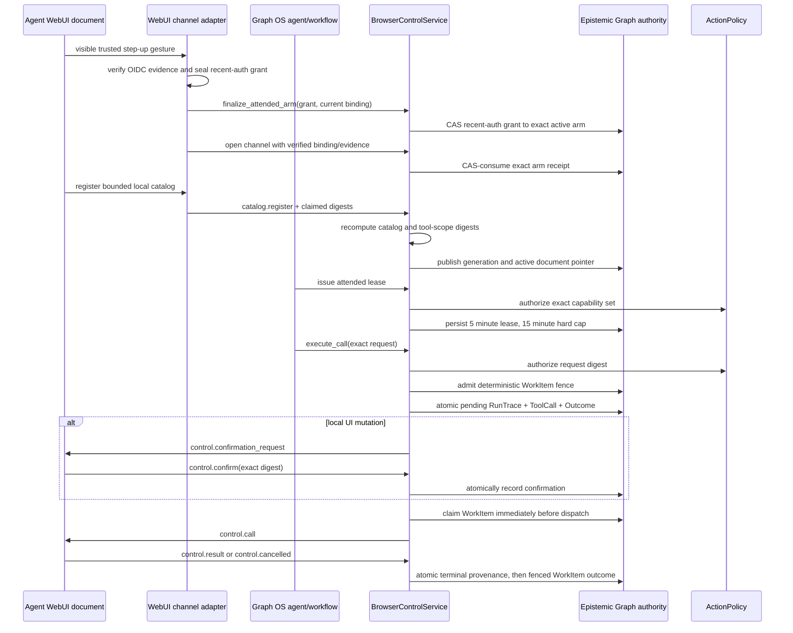

# Governed browser control

`BrowserControlService` is Graph OS's single authority for remote calls to the
small browser-local WebMCP catalog. Agent WebUI supplies an authenticated
document channel and renders confirmation UI. It does not authorize calls,
mint leases, own replay state, or persist outcomes.

The service accepts a verified `GraphSession`, server-generated opaque login,
principal, browser-session, document, and attended-arm references, and trusted
OIDC step-up evidence. A bearer credential alone cannot open the bridge. Agent
WebUI must verify the ID-token signature, issuer, client audience, nonce,
accepted ACR, recent authentication time, and unsealed browser login before it
constructs the server-only binding. No cookie, token, or raw arm receipt crosses
the port.

After a redirect, WebUI sends its short-lived server-only recent-auth grant and
the reloaded page's current document, route, generation, catalog, and tool scope
to `finalize_attended_arm`. Graph OS admits the grant in
`recent_auth_active` and CAS-transitions that same durable node to an active arm
with the final scope. WebSocket open CAS-consumes it. Graph OS accepts only that
final snapshot; pre-redirect document or generation evidence cannot open a
channel.

If finalization succeeds but the socket never opens, the WebUI DELETE path
calls the same port's `revoke_attended_arm` operation before clearing its
cookies. Graph OS validates the exact trusted binding and backchannel session,
then CAS-revokes either an active or consumed receipt. An already revoked or
expired exact receipt is idempotent; mismatched authority fails closed.

Construction requires an asynchronous WebUI/Keycloak introspection or
backchannel revalidator. Graph OS calls it at channel open and on every inbound
message, lease lookup, and call dispatch. The service is unavailable when that
capability is not configured. The verified binding carries a zero-argument
async closure whose captured credential remains inside WebUI; the configured
adapter invokes it without exposing the token to Graph OS. The attended arm
cannot outlive the access token, and every lease is capped by both expiries.

The default lease lifetime is five minutes and the absolute cap is fifteen
minutes. A lease can never outlive its attended arm or access token. In-place
renewal is refused: renewal requires a fresh IdP step-up, new one-use arm,
channel registration, and lease issuance. Sign-out, backchannel revalidation
failure, identity/tenant drift, origin/document/route/generation drift, expiry,
explicit revocation, channel disconnect, timeout, and replay all fail closed.

`catalog.register` carries `catalog_digest` and `tool_scope_digest`. Graph OS
recomputes both from a closed canonical JSON subset and rejects any mismatch
with the browser message or trusted server binding. That subset permits valid
Unicode strings, booleans, null, arrays, objects, and integers in JavaScript's
safe range. It rejects floating numbers, unsafe integers, lone surrogates, and
non-JSON shapes; object keys use JavaScript UTF-16 ordering. Shared Python and
TypeScript vectors pin the exact UTF-8 bytes and digest. The consumed arm binds the
exact ordered descriptor catalog, tool IDs, and schema digests before the
catalog becomes active. Successful registration returns a Graph OS
`CatalogRegistrationReceipt`; the transport emits `channel.ready` only from
that authoritative route, generation, catalog digest, and tool-scope digest.
When a document pointer advances, Graph OS CAS-retires the prior registration;
historical evidence remains queryable without accumulating multiple records
that claim to be active.

Mutation confirmation is a two-message handshake. The browser first receives
`control.confirmation_request` and must not execute it. After the user returns
the exact `sha256:<hex64>` digest, Graph OS durably records that confirmation,
claims the call fence, and sends `control.call` with
`authorization=confirmed_mutation`. Read calls receive only `control.call` with
`authorization=read` and no confirmation digest.

Call arguments and results are validated against the registered JSON schemas.
The result value is capped at 1,500 bytes and the complete channel envelope at
64 KiB. Durable records contain content digests, counts, machine error codes,
and opaque references; they never contain browser tokens, service credentials,
raw arguments, raw results, or page content.

Cancellation reports exactly one effect: `none`,
`browser_reported_committed`, or `unknown`. `unknown` does not claim rollback.
A later browser result can reconcile an in-process uncertain call. Duplicate
MCP, REST, and workflow deliveries derive the same WorkItem ID from the exact
request and cannot claim it for dispatch twice. An uncertain call retains a
30-second late-result window, then a durable `unknown_reaped` audit bounds its
in-memory lifetime and terminalizes its WorkItem fence as a non-retryable
failure. Durable terminal replay recovers the result digest and
observed cancellation effect without persisting the raw result.

Each submission also records a random, server-only admission reference. It is
excluded from request identity, so replays remain deterministic, but it lets a
caller recover a create-then-read failure and retire only the WorkItem that its
own delivery created. A pre-existing fence created by another delivery carries
a different reference and is never cancelled by that recovery.

Every call audit uses the canonical trace ontology. The pending audit is one
native atomic batch containing `RunTrace`, `ToolCall`, `OutcomeEvaluation`, and
their edges; audit failure cancels the unclaimed fence and prevents dispatch.
Terminal trace evidence is durable before the WorkItem terminal transition.
Trace evidence uses the caller's content graph, while the deterministic
WorkItem remains in Graph OS's existing `__control__` authority; durable replay
queries each record through its owning graph view.
Langfuse is reported as
`recorded`, `not_configured`, or `unavailable`, and no Langfuse trace identifier
is fabricated.

GraphOS keeps its server-side request and durable receipt contracts under
`graph_os.browser_control`. The host injects the resulting service through
agent-webui's existing `BrowserControlPort`; it does not define a second WebUI
transport or ask AU to host the authority. `browser_control_factory_kwargs`
injects `browser_control=None` unless the WebUI factory supports that port, an
async IdP backchannel revalidator is provided, and the active engine exposes
native typed-batch, WorkItem, query, create-if-absent, and CAS authorities.

Authorized server-side agents call the action-routed `browser_control` tool.
Its MCP form, automatic REST twin at `/browser/control`, and native workflow
toolset all invoke `dispatch_browser_control`; that adapter marshals onto the
event loop that owns the exact service injected into WebUI. It rejects calls
until the attended WebUI loop is live and requires the caller's ambient
`kg:write` session to match the channel actor and tenant. The browser socket is
response-only: it registers capabilities and returns confirmation, result, or
cancellation events, but cannot mint its own lease or initiate a call.

## Module boundaries

The implementation keeps dependencies pointed from wire contracts to durable
authorities to runtime behavior. WebUI's validated Pydantic messages are
revalidated into GraphOS's server-side trust contracts at the connection seam;
there is no compatibility facade or AU runtime copy.

| Modules | Single responsibility |
| --- | --- |
| `browser_control_common`, `descriptor`, `api`, `attendance_api` | Canonical JSON/digests, one tool descriptor, GraphOS requests/receipts, and internal validated attendance state |
| `browser_control_client`, `server`, `port` | Inbound and outbound trust validation plus the connection protocol; the product port is agent-webui's `BrowserControlPort` |
| `browser_control_binding`, `attended`, `attendance` | Privacy-safe exact binding, one-use durable authority, and server-facing attendance lifecycle |
| `browser_control_registration`, `durability` | Catalog/document authority and lease/WorkItem persistence |
| `browser_control_state`, `validation`, `runtime` | Volatile handles, shared fail-closed validation, and the same-instance cross-loop caller binding |
| `browser_control_channel`, `lease`, `policy` | Channel/catalog lifecycle, lease lifecycle, and ActionPolicy decisions |
| `browser_control_dispatch`, `cancellation`, `provenance`, `outcome`, `service` | Policy/schema admission, fenced dispatch, cancellation, durable audit/replay, outcome convergence, and final composition |
| `mcp` + `graph_os.mcp_server` | One governed MCP/REST action router over the runtime binding |

There is no browser-control persistence adapter or alternate executor. Durable
records use the active Graph OS authority, and browser execution only uses the
authenticated channel sender.

Catalog publication uses a recoverable three-step transition: create the
registration as `pending`, atomically advance the document pointer, then mark
the pointed registration `published`. The document is the sole `active`
authority, so a failed transition cannot leave two active registrations.
Disconnect durably retires the current registration and its exact journal
predecessor before it revokes the attended receipt. Transient authority
failures retain a shielded cleanup task that retries without blocking the
event loop.
