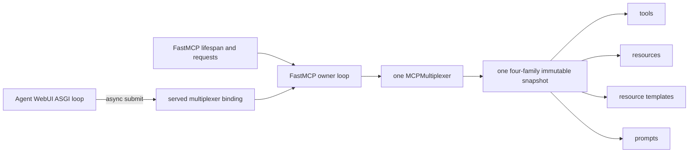

# Fleet gateway

`graph_os.fleet` owns the in-process MCP fleet gateway: child lifecycle and
resilience, remote OAuth admission, bounded discovery and health probes,
collision-free tool prefixes, and per-session dynamic loading/unloading.
`MCPMultiplexer` is a native implementation in this repository; it is not an
import or compatibility alias for AU's former multiplexer.

The catalog boundary is `FleetCatalogReader`, which joins EG's live
`RegisterServer` rows with current `AgentComponent` records and verified
content. A serving composition passes that reader to `attach_fleet_loader()`
and awaits `MCPMultiplexer.refresh_engine_catalog()` before starting children.
The reader path fails closed until a verified snapshot exists and never falls
back to a static config file.

## Served-loop ownership

The FastMCP server owns the only live multiplexer event loop. The colocated
Agent WebUI runs on its own ASGI loop, so its GraphOS-native inventory, call,
and resource helpers submit asynchronous operations through
`graph_os.fleet.shared_multiplexer.run_on_served_multiplexer`. The submitted
coroutine is created as a task on the serving loop with the caller's verified
context; the WebUI awaits the concurrent completion and never blocks a thread
on `Future.result()`. Raw multiplexer access from a foreign loop fails closed.

Catalog reconciliation still requires the durable writer to acknowledge the
candidate's exact `catalog_generation` and `snapshot_digest` before atomic
publication. GraphOS no longer imports AU's source-sync writer. Until
epistemic-graph exposes the governed generic MCP resource/template durability
operation, the writer capability is absent and refresh returns the typed
`reingestion-unreconciled` failure. It does not claim convergence or maintain
a second process-local durability store.

The gateway dashboard and Langfuse deployment doctor are consumers of this
same served authority. Widget calls discover the child's admitted schema before
delegation. The doctor proves `langfuse_observability` posture and a bounded
trace read through the child MCP tool. The release canary independently checks
the catalog declaration, launcher, and advertised tool; none of these paths
imports a connector package. Langfuse reads no longer trigger a GraphOS-owned
knowledge-graph ingestion side effect—durable ingestion remains the SDK/EG
runner contract from RF-ADR-009.

## G2 cutover checklist

1. The graph-os MCP composition imports `attach_fleet_loader` and
   `SessionVisibilityMiddleware` from `graph_os.fleet`, supplies the EG reader,
   and refreshes the catalog before child startup.
2. The MCP composition binds the returned instance through
   `graph_os.fleet.shared_multiplexer` so REST and WebUI consumers observe the
   same lifecycle, health, OAuth, and discovery state. A FastMCP extension
   claims the owner loop during server lifespan startup; co-services use only
   the async submission API.
3. Gateway route composition installs its `GatewayApplicationPort` before
   `register_graph_routes()` and delegates fleet OAuth/toggle reads to that
   same instance.
4. Cut over AU consumers atomically: `mcp/kg_server.py` (composition and
   probe-port binding), `mcp/shared_multiplexer.py`,
   `server/routers/mcp_catalog.py`, `server/webui_mcp_delegation.py`,
   `gateway/registry_api.py`, `mcp/tools/intent_tools.py`,
   `capabilities/fleet_tool_search.py`, `orchestration/agent_runner.py`, and
   `tools/dynamic_tool_orchestrator.py`.
5. Keep AU's `knowledge_graph/ingestion/fleet_skill_harvest.py` and
   `fleet_prompt_harvest.py` out of this cutover; pack ingestion is the SDK/EG
   path. AU release/certification, analytics, and connector-certification
   scripts remain in their assigned repositories.

The `graph-os` console script and live service deployment remain on the AU MCP
entrypoint until the coordinated MCP composition cutover is complete.
