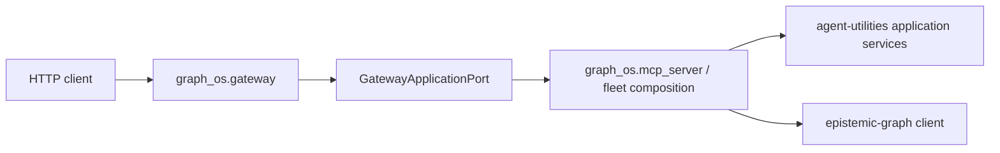
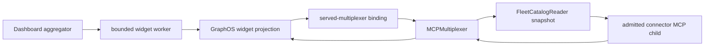

# REST gateway

`graph_os.gateway` owns HTTP routing, dashboard aggregation, the widget
registry, and the `graph-os-daemon` host lifecycle. Agent, graph, ontology,
catalog, and policy behavior remains owned by agent-utilities or
epistemic-graph.

The G1/G2 boundary is `GatewayApplicationPort`. The G2 composition root must
install one implementation with `configure_gateway_application()` before it
calls `register_graph_routes()`.

There is no fallback import of AU's `kg_server` or multiplexer. An unconfigured
process fails closed before routes are served, making consumer cutover
observable rather than silently selecting the legacy implementation.

## Connector widgets

Dashboard widgets retain only presentation and response-projection logic in
`graph_os.gateway.widgets`. They do not import later-phase connector packages or
construct vendor API clients. Each connector operation is resolved from the
served multiplexer tool catalog and invoked with
`MCPMultiplexer.delegate_server_tool()` through
`run_on_served_multiplexer()`. Credentials, TLS, child lifecycle, and tool
admission therefore remain at the connector/fleet boundary.

A connector absent from the EG-backed catalog, an ambiguous operation, or a
child failure produces the widget's existing correlation-safe error shape.
GraphOS never falls back to package importability or direct vendor credentials.
