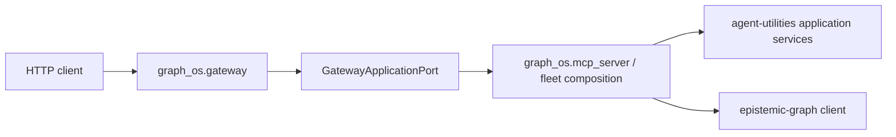

# REST gateway

`graph_os.gateway` owns HTTP routing, dashboard aggregation, the widget
registry, and the `graph-os-daemon` host lifecycle. Agent, graph, ontology,
catalog, and policy behavior remains owned by agent-utilities or
epistemic-graph.

The G1/G2 boundary is `GatewayApplicationPort`. The G2 composition root must
install one implementation with `configure_gateway_application()` before it
calls `register_graph_routes()`.

There is no fallback import of AU's `kg_server` or multiplexer. An unconfigured
process fails closed before routes are served, making consumer cutover
observable rather than silently selecting the legacy implementation.
