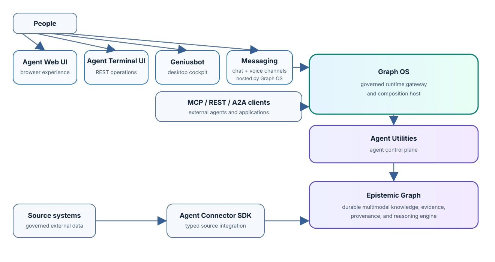

<section class="site-hero" aria-labelledby="graphos-title">
  
The governed runtime door

  <h1 class="site-hero__title" id="graphos-title">Run the whole agent platform through one clear boundary.</h1>
  

    GraphOS is the process you run. It authenticates MCP, REST, A2A, and browser
    requests; composes the agent and graph services behind them; and supervises
    the connector fleet from one serving lifecycle.
  

  

    <a class="md-button md-button--primary" href="get-started/">Start GraphOS</a>
    <a class="md-button" href="architecture/">See how it fits</a>
  

</section>

<figure class="site-architecture" markdown>
  
  <figcaption>One request path, five deliberately separate authorities.</figcaption>
</figure>

  <article class="site-card" markdown>
    
Try it

    

      Install the bundled runtime, generate a local profile, validate it, and
      register the MCP launcher with Codex.
    

    <a href="get-started/">Open the quick start →</a>
  </article>
  <article class="site-card" markdown>
    
Understand it

    

      Follow a request from client to GraphOS, agent control plane, durable
      graph, and connector service without blurring ownership.
    

    <a href="architecture/">Explore the architecture →</a>
  </article>
  <article class="site-card" markdown>
    
Operate it

    

      Configure local or network transports, validate authority, inspect
      readiness, and run the release canary.
    

    <a href="deployment/">Use the deployment guide →</a>
  </article>

## What GraphOS owns

  

    

      GraphOS owns
      Process lifecycle, MCP and REST composition, unary A2A, request policy, fleet supervision, and optional WebUI hosting.
    

    

      GraphOS delegates
      Agent decisions to agent-utilities, durable state and reasoning to epistemic-graph, source effects to connector services, and presentation to Agent WebUI.
    

  

GraphOS does not copy those authorities. It binds their public contracts into
one identity-aware application surface and reports unavailable authority
explicitly.

## Follow one request

<ol class="site-flow">
  <li class="site-flow__step">
    Enter through one door
    An MCP, REST, A2A, or WebUI request reaches the GraphOS serving process.
  </li>
  <li class="site-flow__step">
    Establish authority
    GraphOS verifies identity, tenant, requested action, and the applicable policy.
  </li>
  <li class="site-flow__step">
    Route to the owner
    Agent work reaches agent-utilities; graph work reaches epistemic-graph; source work reaches an admitted connector.
  </li>
  <li class="site-flow__step">
    Return evidence
    The caller receives a transport-specific response backed by the same governed result and provenance.
  </li>
</ol>

## Choose the right room

| If you need to… | Go to… |
|---|---|
| Run MCP, REST, A2A, WebUI, or fleet supervision | **GraphOS** — you are here |
| Build agents, workflows, evaluations, or skills | [agent-utilities](https://knuckles-team.github.io/agent-utilities/) |
| Store, query, reason over, or prove durable knowledge | [epistemic-graph](https://knuckles-team.github.io/epistemic-graph/) |
| Build and certify a source connector | [agent-connector-sdk](https://knuckles-team.github.io/agent-connector-sdk/) |
| Use the platform in a browser | [Agent WebUI](https://knuckles-team.github.io/agent-webui/) |

The [capability status](status.md) is the exact account of the surfaces shipped
by this package.
