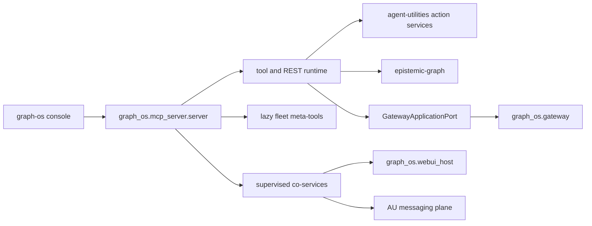

# MCP server composition

`graph_os.mcp_server` owns the graph-os transport and composition boundary. The
action implementations remain in the agent plane and epistemic-graph; graph-os
registers them once and exposes the same core through MCP and REST.

The serving lifecycle mints process authority, bootstraps the engine, installs
the gateway application adapter, attaches the lazy fleet surface, starts the
native WebUI host when configured, and then serves `stdio` or
`streamable-http`. Optional WebUI imports remain lazy.

The fleet loader uses GraphOS's native multiplexer. Its EG-backed catalog read
is capability-gated on the generated kind-only `AgentComponent.Search` client
contract. When that authority is unavailable, catalog refresh fails closed; it
does not substitute a static reader. See [Capability status](status.md).
