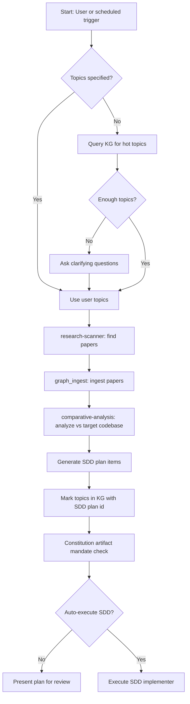

# Graph OS evolution

Turn new evidence or runtime failures into a bounded proposal, validate it
against the existing system, and promote only improvements that pass review
and regression gates. Combines research discovery with code-health analysis
tailored to agent-utilities' 5-pillar, KG-driven architecture (ORCH, KG, AHE,
ECO, OS).

Keep evidence triage, proposal, and evaluation ownership here; hand concrete
approved implementation and diff review to `agent-utilities-development`.

## Overview

This skill orchestrates **7 capabilities** into one evolution pipeline:

### Research pipeline

1. **Topic detection** — query the KG for hot topics, unresolved concepts, and
   high-scoring unimplemented research findings.
2. **Research scanner** — find new papers matching those topics via the
   `scholarx` MCP.
3. **Knowledge Graph ingest** — ingest discovered papers and codebases into
   the KG.
4. **Comparative analysis** — analyze ingested items against the target
   codebase (default: agent-utilities) for gaps and feature extraction.
5. **SDD plan generation** — create implementation plans with
   constitution-mandated artifacts.

### Code-health pipeline (adapted from `code-enhancer`)

6. **Wiring sweep** — AST-based import graph, dead-code, and concept
   traceability analysis (see [`scripts/wiring_sweep.py`](scripts/wiring_sweep.py)).
7. **Architecture review** — C4 compliance, pillar concept coverage, and
   hot-path integration audit tailored to the 5-pillar architecture.

### Code-enhancer domains (agent-utilities-specific)

The following analysis domains from the `code-enhancer` skill are natively
integrated, tailored to agent-utilities' 5-pillar architecture:

| Domain | What it checks | agent-utilities specialization |
|--------|---------------|-------------------------------|
| **Concept traceability** | 1:1:1 Code→Tests→Docs coverage for all `CONCEPT:X-Y.Z` tags | Validates against `docs/concept_map.md`; checks pillar doc pages |
| **Architecture review** | C4 component compliance, SOLID principles, deep modules | Validates all 5 pillars have matching C4 diagrams in `architecture_c4.md`; checks mixin MRO integrity |
| **Dependency audit** | `pyproject.toml` deps, version currency | Checks `pydantic-ai`, `pydantic-graph`, `kuzu`, `mcp` version alignment |
| **Test coverage** | Concept-tagged pytest coverage, FIRST rubric | Validates every concept has at least 1 tagged test; checks async test patterns |
| **Engineering heuristics** | Deep module analysis, duplication, naming | Checks for mixin anti-patterns, proper `properties=dict(...)` API usage, consistent logging |
| **Security analysis** | Secret exposure, guardrail coverage | Validates `OS-5.1` security concepts, checks env var exposure in MCP configs |
| **Documentation governance** | README, AGENTS.md, `/docs` completeness | Validates pillar summaries reference all registered concepts |

## Architecture



Use the skill directly to run one bounded stage (a single topic-detection
sweep, one wiring-sweep report, or one proposal). Delegate the full
research-to-implementation pipeline or a scheduled cadence, keeping each
stage's KG writes behind the same review boundary. Use an economy model for
topic detection, relevance scoring, deterministic extraction, and report
generation; escalate to a stronger model for comparative analysis, SDD plan
generation, architecture review, and final synthesis — anywhere evidence
quality directly drives what gets implemented.

## Scheduled runs

The evolution pipeline can also run on a recurring schedule through
`graph_loops` / `graph_schedules` rather than only on direct invocation: a
`research`-kind Loop (`graph_loops(action="submit", kind="research", ...)`)
repeats Steps 1–5 below on its own cadence and logs each pass as an
`EvolutionCycle` node for monitoring. Query `graph_loops(action="state")` for
the live `EvolutionState` (stage, saturation, backlog) and `graph_loops
(action="gaps")` for the open canonical `:Gap` backlog it feeds.

## Graph-native assimilation engine (CONCEPT:AU-KG.query.vendor-agnostic-traversal)

The comparative-analysis → plan-generation work is a **graph-compute
pipeline** (agent-utilities' `knowledge_graph/assimilation/`), not per-source
LLM reading. After sources are ingested, run the assimilation pass — directly
or via MCP:

```
graph_orchestrate(action="assimilate")                    # dedup -> gap -> synergy -> rank
graph_orchestrate(action="assimilate", task="synthesize")  # + propose grounded SDD plans
graph_orchestrate(action="assimilate", task="force")       # ignore the idempotency watermark
```

Stages (all graph operations, LLM only at plan synthesis):

1. **dedup** — collapse the same capability across paper/library/our-code →
   `SIMILAR_TO` + `SUPERSEDES`.
2. **gap** (`auto_satisfy`) — match features vs our `Concept`s →
   `SATISFIED_BY`; `open_features()` excludes anything already built (the
   "stop rediscovering" filter).
3. **synergy** — cross-pillar community detection → `HAS_SYNERGY_WITH`
   bundles.
4. **rank** — leverage = `source_count x (1+centrality)`.
5. **plan synthesis** — grounded SDD proposals from each top gap's KG
   neighborhood.

**Idempotency:** a per-cycle **state watermark** (`(id, status,
content_hash)` of feature/source nodes) skips the pass when nothing changed;
ingest is content-addressed (`canonical_source_id` collapses arxiv/DOI/URL/path
duplicates; `content_fingerprint` per-item skip). Cost grows with the *delta*,
not the *corpus*. On implementation, `ledger.close_out` writes
`DERIVED_FROM_RESEARCH` + `ASSIMILATED_INTO` so the feature is permanently
excluded.

**Multi-source:** ingest docs (PRD/BRD/SOW/tasks → `Requirement`) and chat/SDD
(→ `Decision`) via `assimilation.ingest`, alongside papers, OSS libraries, and
the agent-packages fleet — all into one graph.

## Mining flywheel (CONCEPT:AU-KG.evolution.mining-flywheel)

The loop controller (agent-utilities' `knowledge_graph/research/
loop_controller.py`, `LoopController.run_one_cycle`) runs a `mine_discovery`
stage after `reason` and before `synthesize` each cycle (gated by
`config.kg_loop_mine_discovery`, default **ON**; override per-call via
`graph_loops(action="run", mine_discovery=...)`). It calls the native
`engine_mining`/`graph_learn` clients directly through the shared `_invoke()`
boundary, so it degrades to an empty/no-op result on a no-mining engine
build, and feeds:

- **Step 5 (SDD plan generation) — wired.** Association-rule mining
  (`engine_mining action=associate`) over each `Capability` node's outbound
  neighborhood (`SATISFIED_BY`/`RELATES_TO` concept edges,
  `DERIVED_FROM_RESEARCH` article edges, `HAS_SYNERGY_WITH` sibling-capability
  edges) discovers concept-co-occurrence rules — "capabilities that share
  concept A + B usually also relate to concept/capability Z" — and writes
  them back as `:AssociationRule` nodes for plan generation to read as
  candidate implementations.
- **Step 1 (topic detection) — partially wired.** A coverage-anomaly pass
  (`engine_mining action=anomaly`, z-score over each Capability's
  covered-concept count) flags divergent/under-implemented capabilities as
  `:Anomaly` nodes — a real, queryable topic source today. `graph_learn`
  fit→predict over `Concept` nodes similarly writes `:PredictedEdge` nodes
  suggesting missing concept↔concept relations. **Aspirational** (not
  implemented in this pass): clustering papers/concepts by embedding+citation
  graph to *prioritize* the topic queue by research theme — no code wires
  cluster output into topic ranking yet.

All write-back is **propose-only**: it materializes typed KG facts for a
human/agent to review via `graph_query`/`graph_loops(action="state")`; it
never creates an SDD plan, edits code, or triggers a merge by itself. See
agent-utilities' `knowledge_graph/research/loop_controller.py`
(`_run_mine_discovery` + the three `_mine_*` helpers) and its
`tests/unit/knowledge_graph/test_loop_controller.py` for the concrete call
sequence and scope cuts.

## Workflow

### Step 1 — Topic detection (KG-first)

Query the Knowledge Graph for research topics that haven't been addressed
yet. The engine's native Cypher parser (`eg-query`) has **no `EXISTS {...}`
subquery support** (`WHERE NOT exists { MATCH ... }` is rejected outright),
and the grammar-legal alternative — `OPTIONAL MATCH ... WHERE p.id IS NULL` —
parses but is **live-verified to return 0 rows** instead of "every
unaddressed concept" (property access on the unbound optional variable does
not evaluate to a comparable `NULL` on this engine). So express the negation
as a **set difference over two supported queries** instead of one — the same
pattern agent-utilities' `topic_resolver.unresolved_topics`
(`knowledge_graph/adaptation/topic_resolver.py`) already uses:

```
Use graph_query twice:

1. cypher: "MATCH (c:Concept)-[:ADDRESSED_BY]->(s) RETURN c.id AS id"
   -> the set of already-addressed concept ids

2. cypher: "MATCH (c:Concept) RETURN c.id AS id, c.name AS name, c.description AS description
            ORDER BY c.name LIMIT 150"
   -> candidate topics (raise the LIMIT and retry if fewer than 15 survive the filter below,
      mirroring topic_resolver.unresolved_topics's adaptive limit)

Then subtract in-agent: unresolved = [row for row in (2) if row.id not in ids_from(1)][:15]
```

`ConceptNode` is not a live label in the graph (0 nodes) — `Concept` is the
one real label the topic set lives under.

**Fallback topic sources** (if no unresolved concepts found):

1. Extract from `Concept` nodes with pillar tags (ORCH, KG, AHE, ECO, OS).
2. Mine from recent comparative-analysis gaps via `graph_search`.
3. Check `RELEVANCE_SCORED` edges for high-scoring unimplemented papers.

If fewer than 3 topics are found from any source, ask clarifying questions:

| Question | Default | When to ask |
|----------|---------|--------------|
| Target research areas | KG-derived topics | Always if no topics found |
| arxiv categories to scan | cs.AI, cs.MA, cs.CL, cs.SE | If user doesn't specify |
| Papers per scan | All RSS feed available | If user wants to cap it |
| Target codebase | agent-utilities | If user doesn't specify |
| Auto-execute SDD? | No (generate plan only) | Always ask before execution |

### Step 2 — Research scan

Delegate to the `research-scanner` skill:

1. Use the detected topics to build search queries.
2. Search via `mcp_scholarx_sx_search` with action `recent` for the last 7
   days.
3. Also run the `search` action with topic keywords for broader coverage.
4. Score papers using `research-scanner`'s own `dynamic_scorer.py` (a sibling
   skill in the `universal-skills` package).

### Step 3 — Download and ingest

1. Download top-scoring papers via `mcp_scholarx_sx_storage` with action
   `bulk_download`.
2. Ingest the downloaded PDFs via `graph_ingest`.
3. Monitor ingestion progress via `graph_jobs`.

### Step 4 — Comparative analysis

Run comparative analysis against the target codebase (default:
agent-utilities):

1. Use `graph_analyze` with action `relevance_sweep` to score all ingested
   items against the target codebase.
2. Query rankings via `graph_analyze` with action `relevance_rankings`.
3. For top-ranked items, run `deep_extract` to get structured feature
   recommendations.

### Step 5 — SDD plan generation

Generate an SDD implementation plan incorporating:

1. All feature recommendations from comparative analysis.
2. **Constitution-mandated artifacts** (always include these):
   - `/docs` updates
   - `AGENTS.md` updates
   - `CHANGELOG.md` entries
   - `README.md` updates
   - `.specify/` sync
   - C4 architecture diagrams
   - Pytests for all new functionality
3. Cross-reference with existing SDD plans to avoid duplication.

Before finalizing, **verify against the constitution** with
`graph_analyze(view="constitution")`. Cross-check that the plan includes ALL
7 mandatory post-modification artifacts — a plan that omits any artifact is
**invalid** and must be revised.

### Step 6 — Track topics and log the cycle

Mark topics as addressed in the KG and log the evolution cycle for tracking:

```
Use graph_write with:

action: "upsert_node"
node_type: "SDDPlan"
properties: {"id": "<plan_id>", "created_at": "<timestamp>", "status": "proposed"}

Then for each topic:
action: "create_edge"
source_id: "<topic_id>"
target_id: "<plan_id>"
rel_type: "ADDRESSED_BY"

And for the cycle itself:
action: "upsert_node"
node_type: "EvolutionCycle"
properties: {
    "id": "evo_cycle_<timestamp>",
    "triggered_by": "schedule|user",
    "topics_scanned": <count>,
    "papers_found": <count>,
    "papers_ingested": <count>,
    "recommendations_generated": <count>,
    "sdd_plan_id": "<plan_id or null>",
    "created_at": "<timestamp>"
}
```

`research-scanner`'s own `dynamic_scorer.py` auto-detects topics from the KG;
this skill extends that by also **exporting** the detected topics back to the
KG as `ResearchTopic` nodes for tracking:

```
For each detected topic:
Use graph_write with:

action: "upsert_node"
node_type: "ResearchTopic"
properties: {
    "id": "topic_<slug>",
    "name": "<topic_name>",
    "source": "dynamic_scorer",
    "detected_at": "<timestamp>",
    "pillar": "<ORCH|KG|AHE|ECO|OS>"
}
```

### Step 7 — Validate the improvement

- Compare against the pre-change baseline.
- Include negative and edge cases.
- Verify the live invocation path, not only the optimized artifact.
- Reject a change that moves one score while violating safety, grounding,
  cost, or latency constraints.
- Record failures and corrections as inputs to a later cycle.

### Step 8 — Implement and publish

Use `graph_evolution` for assimilation, a code-correctness/security
`audit_scan` (each Macroscope-class finding files one canonical `:Gap`),
skill distillation, standardization, failure ingestion, component
optimization, and proposal publication. Use `graph_rlm` for confined
long-context execution, its benchmark scoreboard, and `evolve_prompt` (the
GEPA reflective, DW-GRPO-weighted evolutionary optimizer for an
RLM/PredictRLM signature's prompt).

For prompt, skill, routing, or extraction optimization, use the engine-owned
`ProgramOptimize` job. It is the sole optimization path for that generic
system-prompt/tool-description/skill-content surface; record its opaque job
and candidate references in proposal evidence without provider endpoints or
credentials. `graph_rlm`'s `evolve_prompt` is the separate, non-overlapping
RLM-specific evolutionary optimizer above — the two are not the same
mechanism.

Every discovery track (failure/research/skill/audit) files its findings as
the SAME canonical `:Gap` (the unified Gap→SDD→Implement→Promote→Close
spine). Use `graph_loops` for the whole lifecycle: `gaps` (the open backlog,
highest priority first), `submit_gap` (file one by hand), `gap` (one gap plus
its provenance — the SpecProposal it was specified by, the develop-Loop that
resolves it), `run`/`drive` to advance a gap's derived Loop, and
`state`/`specs`/`review` for transparency and steering. Use
`graph_governance`'s `ownership_report` / `ownership_apply` for the read-only
per-graph RBAC-ownership disposition pass — the live mutating grant apply
itself stays a separate, human-gated CLI, never this or any other network
surface.

Implement approved changes with `agent-utilities-development`. Keep skill,
prompt, routing, and extraction optimizations tied to a held-out evaluation
or clear regression test. Report what changed, evidence supporting it, tests
and evaluations run, uncertainty, and any blocked follow-up. Promotion,
merge, deployment, or external publication remains subject to its normal
review boundary.

## Wiring sweep — AST-based codebase analysis

A standalone AST-based analysis tool for detecting dead code, concept
traceability gaps, and import graph anomalies in agent-utilities.

### Usage

```bash
# Full sweep with markdown report
python scripts/wiring_sweep.py /path/to/agent-utilities

# JSON output for CI integration
python scripts/wiring_sweep.py /path/to/agent-utilities --json

# Write report to file
python scripts/wiring_sweep.py /path/to/agent-utilities --output report.md
```

The script is shipped inside this package-owned skill, at
`graph_os/skills/graph-os-evolution/scripts/wiring_sweep.py`, and always
scans `<root>/agent_utilities/` and `<root>/docs/concept_map.md` — point
`root` at an agent-utilities checkout.

### What it analyzes

| Analysis | Description |
|----------|--------------|
| **Import graph** | Builds module-to-module dependency edges from all `import` / `from ... import` statements |
| **Orphan modules** | Finds `.py` files never imported by any non-test, non-init module |
| **Concept traceability** | Cross-references `CONCEPT:X-Y.Z` tags across code → tests → docs |
| **Dead definitions** | Functions/classes defined but never referenced in any other file |
| **Health score** | 0-100 composite score (40pt concept coverage + 25pt orphans + 25pt dead code + 10pt syntax) |

### Health score grading

| Score | Grade | Meaning |
|-------|-------|---------|
| 80-100 | Green | Healthy — all concepts wired, minimal dead code |
| 60-79 | Yellow | Needs attention — some gaps in traceability or orphaned modules |
| 0-59 | Red | Critical — significant wiring gaps or dead code |

### CI integration

The script exits with code 1 if the health score is below 60, making it
suitable for use as a pre-commit check or CI gate in agent-utilities:

```yaml
# .config/pre-commit.yaml
- repo: local
  hooks:
    - id: wiring-sweep
      name: Wiring Sweep
      entry: python scripts/wiring_sweep.py . --json
      language: system
      pass_filenames: false
```

### Triggers

When the user says any of:

- "wiring sweep", "run wiring sweep"
- "concept audit", "concept traceability check"
- "dead code analysis", "find dead code"
- "traceability check"
- "code health", "check code health"

Execute the sweep, then present the markdown report to the user and
highlight:

1. Any concepts with `missing_tests` or `missing_docs`.
2. Orphan modules with high line counts (likely unmigrated code).
3. Dead definitions that may need cleanup.

## Ecosystem standardization

The evolution pipeline also governs cross-project standardization across the
agent-packages ecosystem, keeping each agent's structure, documentation, and
concept traceability consistent.

### CONCEPT ID bridge strategy

All agent-packages projects connect to agent-utilities via
`CONCEPT:AU-ECO.messaging.native-backend-abstraction` (Unified Toolkit
Ingestion). Each project has:

- A unique CONCEPT prefix (e.g. `PORT-` for portainer-agent, `SNOW-` for
  servicenow-api).
- A `docs/concepts.md` registry mapping local concepts to cross-project
  references.
- Tool descriptions annotated with CONCEPT IDs for KG ingestion.

**Prefix registry** (39 unique prefixes, zero collisions):

| Prefix | Project | | Prefix | Project |
|--------|---------|---|--------|--------|
| `ABOX` | archivebox-api | | `ARR` | arr-mcp |
| `ATL` | atlassian-agent | | `AU` | agent-utilities |
| `CMGR` | container-manager-mcp | | `DSCI` | data-science-mcp |
| `DOCDB` | documentdb-mcp | | `GENIUS` | genius-agent |
| `GH` | github-agent | | `GL` | gitlab-api |
| `HASS` | home-assistant-agent | | `JELLYFIN` | jellyfin-mcp |
| `LF` | langfuse-agent | | `LIX` | leanix-agent |
| `LM` | listmonk-api | | `MEAL` | mealie-mcp |
| `MDLD` | media-downloader | | `MSFT` | microsoft-agent |
| `NC` | nextcloud-agent | | `OC` | owncast-agent |
| `PA` | postiz-agent | | `PLANE` | plane-agent |
| `PORT` | portainer-agent | | `QBT` | qbittorrent-agent |
| `RM` | repository-manager | | `SNOW` | servicenow-api |
| `SRX` | searxng-mcp | | `SX` | scholarx |
| `SYS` | systems-manager | | `STIRLINGPDF` | stirlingpdf-agent |
| `TUI` | agent-terminal-ui | | `TUN` | tunnel-manager |
| `UKA` | uptime-kuma-agent | | `VEC` | vector-mcp |
| `WEBUI` | agent-webui | | `WGER` | wger-agent |
| `ANSIBLE` | ansible-tower-mcp | | | |

### Cross-project synergy mapping

When ingesting any agent-package codebase via the KG, the following
synergies are automatically detected and mapped:

1. **ECO-4.0 → All agents**: Every agent's MCP tools are discoverable via
   unified ingestion.
2. **ORCH-1.2 → All agents**: Confidence-gated routing applies to all MCP
   tool domains.
3. **OS-5.* → All agents**: Security, scheduling, and guardrails are
   inherited from agent-utilities.
4. **KG-2.* → All agents**: Knowledge graph concepts bridge all codebase
   ingestion.

### Standardization audit checklist

As part of each evolution cycle, verify:

- [ ] Every agent has `docs/concepts.md` with a unique prefix.
- [ ] No CONCEPT prefix collisions across the ecosystem.
- [ ] All `auth.py` use standard env var patterns (`_URL`, `_TOKEN`,
      `_SSL_VERIFY`).
- [ ] All agents have `CHANGELOG.md`.
- [ ] No `legacy_readme.md` files remain in `docs/`.
- [ ] The `mcp/` subdirectory standard is documented (existing agents
      migrated over time).

## Guardrails

- Keep autonomous discovery and proposal generation separate from approval
  and production mutation.
- Do not fabricate research coverage, evaluation scores, or implementation
  evidence.
- Bound loop depth, fan-out, cost, and recurrence.
- Do not use live secrets, private endpoints, personal data, or
  machine-specific paths in evaluation material.

## References

- [`research-scanner`](https://github.com/Knuckles-Team/universal-skills/blob/main/universal_skills/research/research-scanner/SKILL.md) — paper discovery and scoring (lives in the sibling `universal-skills` package).
- [`comparative-analysis`](https://github.com/Knuckles-Team/universal-skills/blob/main/universal_skills/research/comparative-analysis/SKILL.md) — feature extraction (lives in the sibling `universal-skills` package).
- [`graph-ingestion-and-integration`](../graph-ingestion-and-integration/SKILL.md) — bulk ingestion.
- [`sdd-implementer`](https://github.com/Knuckles-Team/universal-skills/blob/main/universal_skills/development/sdd-implementer/SKILL.md) — task execution (lives in the sibling `universal-skills` package).
