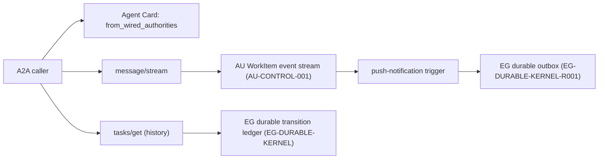

# A2A streaming, push and transition-history projection — architecture

Status: **READY FOR IMPLEMENTATION**. Delivery: **NOT ACCEPTED** except `GRAPHOS-A2A-R001.1`, landed in this PR. Governing [spec](spec.md).

## Existing system and reuse

`graph_os/a2a/models.py` already defines `A2AAgentCapabilities` and (added in this PR) `A2AStreamingAuthority`, `A2APushNotificationAuthority`, `A2ATransitionHistoryAuthority` runtime-checkable protocols plus `from_wired_authorities`. `graph_os/a2a/application.py` and `graph_os/a2a/composition.py` wire the serving application; `graph_os/a2a/authority.py` already defines the `-32010` `A2AStreamingUnavailable` refusal pattern for `tasks/resubscribe` that `A2ATransitionHistoryUnavailable` (A2A-H04) reuses as its sibling error. No new task store, event log, or history ledger is justified: this spec extends existing composition, not a new authority.

## Architecture and durable identities

`A2AAgentCapabilities.from_wired_authorities` is the single seam composition calls; it is pure and has no I/O, so advertised capabilities can be tested without a live AU/EG stack. The actual streaming and history projections are separate runtime paths that call the AU/EG public ports directly — the Agent Card's `true`/`false` is a property of what composition wired, and the test-spec's acceptance (A2A-H07) cross-checks the two never drift apart.

## Implementation sequence

1. **`GRAPHOS-A2A-R001.1` (this PR):** typed capability model and protocols in `graph_os/a2a/models.py`, with unit tests proving default-false, selective-true and non-conforming-object refusal. No wiring yet — `A2AAgentCard`'s default factory still produces all-false, matching current truthful behavior.
2. Depend on `GRAPHOS-A2A-002` landing (context-budget subset) before implementing the actual streaming cursor and push-trigger wiring, since both reuse its bounded-cursor machinery rather than duplicating it.
3. Implement `message/stream` against the AU WorkItem event port (`AU-CONTROL-001`); on a gap, return the existing typed `UNAVAILABLE`.
4. Implement `tasks/get` history read-through to EG's durable kernel (`EG-DURABLE-KERNEL`); on an absent/unreachable authority, return the new `A2ATransitionHistoryUnavailable` (A2A-H04).
5. Implement push-notification delivery over EG's durable outbox (`EG-DURABLE-KERNEL-R001`) with dead-letter reporting.
6. Wire real authorities into composition only after each path is proven; run the full test-spec and flip the relevant capability field to a live `true` at that revision, never earlier.

## Quality and environment

Use `uv sync --extra test`, focused `uv run pytest tests/a2a`, Ruff, mypy, repository pre-commit hooks. Keep one Agent Card capability seam (`from_wired_authorities`); no second ad hoc truthiness check elsewhere in the codebase. CI fixtures for steps 3–5 start an ephemeral local AU/EG fixture; this PR's `R001.1` slice needs no live stack since the model is pure.
