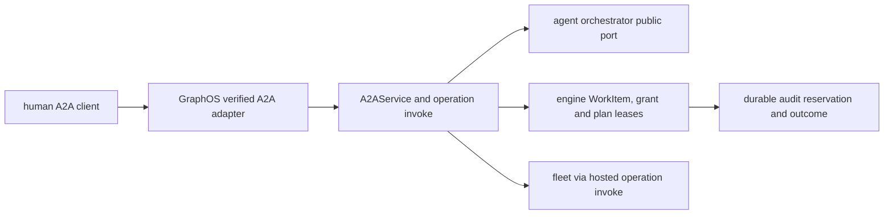

# A2A task and approval projection — architecture

Status: **READY FOR IMPLEMENTATION**. Delivery: **NOT ACCEPTED**. Governing [spec](spec.md).

## Existing system and reuse

`graph_os.a2a.application` already implements authenticated Agent Card and unary `message/send`, `tasks/get/list/cancel`; `graph_os.a2a.service.A2AService` calls an `A2ARouter` and `A2ATaskAuthority`. `graph_os.a2a.composition.compose_a2a` wires `OrchestratorA2ARouter` and `WorkItemA2AAuthority` to the serving application. `graph_os.a2a.models` provides typed A2A messages and tasks. Extend these modules and public ports. Keep the existing FastMCP owner loop, fleet and verified-session middleware. No new broker or task database is justified by this projection.

## Architecture and durable identities

`task_id` is an opaque projection of the durable parent WorkItem, and child dispatch IDs are stored in a typed parent-child relation. `tasks/get/list` read that authority, not an A2A-local cache. `message/stream` emits ordered WorkItem events with a resume cursor; `tasks/resubscribe` resumes after the last acknowledged event and deduplicates on event ID. If the upstream contract cannot represent the relation or input-required state, the GraphOS method reports typed `UNAVAILABLE` until the published package provides it.

An operation request uses the hosted registry and `invoke` pipeline, not an A2A-specific authorization implementation. The verified A2A adapter supplies actor, tenant, effective scopes, auth mode, policy revision and session provenance. The response carries the hosted API envelope within JSON-RPC `result`; JSON-RPC transport errors remain protocol errors. This preserves the engine/fleet's source error code and a privacy-safe message.

When the orchestrator pauses on a pending effect, GraphOS issues a durable plan lease bound to `(task_id, parent_work_item_id, child_work_item_id, pending_call_id, op_id, params_digest, principal, tenant, policy_revision, registry_digest, expiry)`. It sends an `input-required` event with a safe preview. The client obtains a fresh authenticated human signature/grant through the public identity contract; the service never stores the bearer itself. On `graphos.plan/confirm`, GraphOS verifies the original human and each bound identity, asks the engine to atomically consume the human grant and plan fence, then dispatches through the common invocation pipeline. If any authority changes, return a stable refusal and preserve zero effect. A console-only admin effect instead returns a URL and is confirmed only on the console surface.

Pre-effect audit reservation and post-effect outcome linking use the shared hosted-operation service. A two-person approval must prove two distinct qualified humans using the same durable relation; no service or delegated agent can synthesize either participant. All claims are rechecked at resume time. A canceled task cannot be confirmed; a committed effect is not treated as reversible by task cancellation.

## Implementation sequence

1. Inventory published WorkItem, assembly, grant, plan lease, audit, and task-event contracts; pin versions and make unsupported capabilities typed unavailable.
2. Extend A2A method table and models for `message/stream`, `tasks/resubscribe`, `graphos.op/invoke`, and `graphos.plan/confirm`; reuse `A2AService` and serving composition.
3. Add durable parent/child resolution, event cursor and input-required projection using public ports. Ensure no separate task state or private agent import.
4. Bind pending calls to an attested original human and revocable grant; integrate atomic fence and shared invocation/audit path. Keep approval disabled until exact served proof.
5. Generate/update public client contract and status, run [test-spec.md](test-spec.md), record exact default-branch evidence, then enable approval.

## Quality and environment

Use `uv sync --extra test`, focused `uv run pytest tests/a2a tests/api`, Ruff, mypy, repository pre-commit hooks and wheel build. The shared hooks include CCCC, KISS, jscpd and Dupehound; do not weaken their configured thresholds or add suppressions. Keep one application service and one method table; use typed adapters and small functions. CI fixtures should start an ephemeral local engine/agent stack with synthetic principals and no external secrets. A separate served test verifies restart/resume. Public docs must describe only observed capability at the accepted revision.
