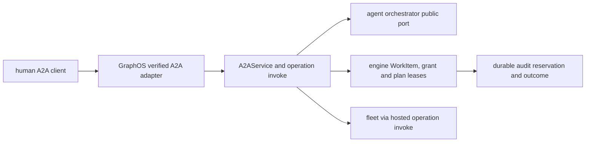
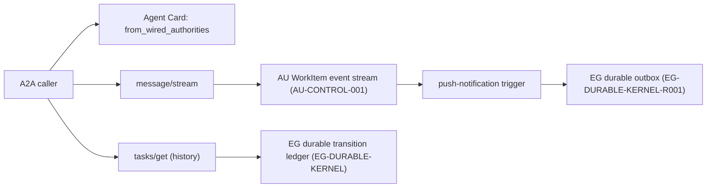
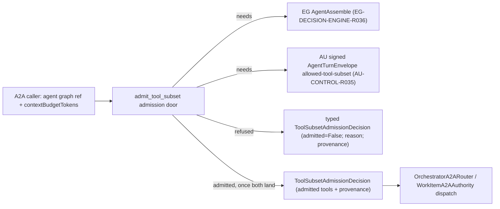

# GRAPHOS-A2A — A2A projection, streaming, history and tool-subset admission — architecture

## A2A task and approval projection
Status: **READY FOR IMPLEMENTATION**. Delivery: **NOT ACCEPTED**. Governing [spec](spec.md).

### Existing system and reuse

`graph_os.a2a.application` already implements authenticated Agent Card and unary `message/send`, `tasks/get/list/cancel`; `graph_os.a2a.service.A2AService` calls an `A2ARouter` and `A2ATaskAuthority`. `graph_os.a2a.composition.compose_a2a` wires `OrchestratorA2ARouter` and `WorkItemA2AAuthority` to the serving application. `graph_os.a2a.models` provides typed A2A messages and tasks. Extend these modules and public ports. Keep the existing FastMCP owner loop, fleet and verified-session middleware. No new broker or task database is justified by this projection.

### Architecture and durable identities

`task_id` is an opaque projection of the durable parent WorkItem, and child dispatch IDs are stored in a typed parent-child relation. `tasks/get/list` read that authority, not an A2A-local cache. `message/stream` emits ordered WorkItem events with a resume cursor; `tasks/resubscribe` resumes after the last acknowledged event and deduplicates on event ID. If the upstream contract cannot represent the relation or input-required state, the GraphOS method reports typed `UNAVAILABLE` until the published package provides it.

An operation request uses the hosted registry and `invoke` pipeline, not an A2A-specific authorization implementation. The verified A2A adapter supplies actor, tenant, effective scopes, auth mode, policy revision and session provenance. The response carries the hosted API envelope within JSON-RPC `result`; JSON-RPC transport errors remain protocol errors. This preserves the engine/fleet's source error code and a privacy-safe message.

When the orchestrator pauses on a pending effect, GraphOS issues a durable plan lease bound to `(task_id, parent_work_item_id, child_work_item_id, pending_call_id, op_id, params_digest, principal, tenant, policy_revision, registry_digest, expiry)`. It sends an `input-required` event with a safe preview. The client obtains a fresh authenticated human signature/grant through the public identity contract; the service never stores the bearer itself. On `graphos.plan/confirm`, GraphOS verifies the original human and each bound identity, asks the engine to atomically consume the human grant and plan fence, then dispatches through the common invocation pipeline. If any authority changes, return a stable refusal and preserve zero effect. A console-only admin effect instead returns a URL and is confirmed only on the console surface.

Pre-effect audit reservation and post-effect outcome linking use the shared hosted-operation service. A two-person approval must prove two distinct qualified humans using the same durable relation; no service or delegated agent can synthesize either participant. All claims are rechecked at resume time. A canceled task cannot be confirmed; a committed effect is not treated as reversible by task cancellation.

### Implementation sequence

1. Inventory published WorkItem, assembly, grant, plan lease, audit, and task-event contracts; pin versions and make unsupported capabilities typed unavailable.
2. Extend A2A method table and models for `message/stream`, `tasks/resubscribe`, `graphos.op/invoke`, and `graphos.plan/confirm`; reuse `A2AService` and serving composition.
3. Add durable parent/child resolution, event cursor and input-required projection using public ports. Ensure no separate task state or private agent import.
4. Bind pending calls to an attested original human and revocable grant; integrate atomic fence and shared invocation/audit path. Keep approval disabled until exact served proof.
5. Generate/update public client contract and status, run [test-spec.md](test-spec.md), record exact default-branch evidence, then enable approval.

### Quality and environment

Use `uv sync --extra test`, focused `uv run pytest tests/a2a tests/api`, Ruff, mypy, repository pre-commit hooks and wheel build. The shared hooks include CCCC, KISS, jscpd and Dupehound; do not weaken their configured thresholds or add suppressions. Keep one application service and one method table; use typed adapters and small functions. CI fixtures should start an ephemeral local engine/agent stack with synthetic principals and no external secrets. A separate served test verifies restart/resume. Public docs must describe only observed capability at the accepted revision.

## A2A streaming, push notifications and transition-history projection
Status: **READY FOR IMPLEMENTATION**. Delivery: **NOT ACCEPTED** except `GRAPHOS-A2A-R009.1`, landed in this PR. Governing [spec](spec.md).

### Existing system and reuse

`graph_os/a2a/models.py` already defines `A2AAgentCapabilities` and (added in this PR) `A2AStreamingAuthority`, `A2APushNotificationAuthority`, `A2ATransitionHistoryAuthority` runtime-checkable protocols plus `from_wired_authorities`. `graph_os/a2a/application.py` and `graph_os/a2a/composition.py` wire the serving application; `graph_os/a2a/authority.py` already defines the `-32010` `A2AStreamingUnavailable` refusal pattern for `tasks/resubscribe` that `A2ATransitionHistoryUnavailable` (A2A-H04) reuses as its sibling error. No new task store, event log, or history ledger is justified: this spec extends existing composition, not a new authority.

### Architecture and durable identities

`A2AAgentCapabilities.from_wired_authorities` is the single seam composition calls; it is pure and has no I/O, so advertised capabilities can be tested without a live AU/EG stack. The actual streaming and history projections are separate runtime paths that call the AU/EG public ports directly — the Agent Card's `true`/`false` is a property of what composition wired, and the test-spec's acceptance (A2A-H07) cross-checks the two never drift apart.

### Implementation sequence

1. **`GRAPHOS-A2A-R009.1` (this PR):** typed capability model and protocols in `graph_os/a2a/models.py`, with unit tests proving default-false, selective-true and non-conforming-object refusal. No wiring yet — `A2AAgentCard`'s default factory still produces all-false, matching current truthful behavior.
2. Depend on `GRAPHOS-A2A` landing (context-budget subset) before implementing the actual streaming cursor and push-trigger wiring, since both reuse its bounded-cursor machinery rather than duplicating it.
3. Implement `message/stream` against the AU WorkItem event port (`AU-CONTROL-001`); on a gap, return the existing typed `UNAVAILABLE`.
4. Implement `tasks/get` history read-through to EG's durable kernel (`EG-DURABLE-KERNEL`); on an absent/unreachable authority, return the new `A2ATransitionHistoryUnavailable` (A2A-H04).
5. Implement push-notification delivery over EG's durable outbox (`EG-DURABLE-KERNEL-R001`) with dead-letter reporting.
6. Wire real authorities into composition only after each path is proven; run the full test-spec and flip the relevant capability field to a live `true` at that revision, never earlier.

### Quality and environment

Use `uv sync --extra test`, focused `uv run pytest tests/a2a`, Ruff, mypy, repository pre-commit hooks. Keep one Agent Card capability seam (`from_wired_authorities`); no second ad hoc truthiness check elsewhere in the codebase. CI fixtures for steps 3–5 start an ephemeral local AU/EG fixture; this PR's `R001.1` slice needs no live stack since the model is pure.

## A2A context-budget tool-subset admission
Status: **READY FOR IMPLEMENTATION**. Delivery: **NOT ACCEPTED**. Governing [spec](spec.md).

### Existing system and reuse

`graph_os.a2a.models.A2AContextBudget` already carries the caller-declared `contextBudgetTokens` wire field, and `graph_os.a2a.routing.OrchestratorA2ARouter` already fails closed (`A2AAssemblyUnavailable`) whenever a route request carries a non-null `context_budget_tokens`, with an explicit comment naming both upstream gaps: EG `AgentAssemble` is a refusal stub and the signed AU dispatch carrier cannot carry an allowed-tool subset. `graph_os.a2a.authority.WorkItemA2AAuthority._enqueue`/`dispatch` likewise refuse whenever `decision.selected_tools` is non-empty, per `graph_os/a2a/authority.py:242,274`. This spec does not replace that router or authority; it factors the admission decision they both need into one typed, independently testable door: `graph_os.a2a.admission`.

### Architecture

`ToolSubsetAdmissionRequest` and `ToolSubsetAdmissionDecision` (`graph_os/a2a/admission.py`) are typed `pydantic` models reusing the existing `_WireModel` base and `A2AContextBudget` type from `graph_os.a2a.models`, so the wire shape stays consistent with the rest of the A2A facade. `admit_tool_subset` is a pure function: given a request, it returns a decision. Today it always refuses with `EG_ASSEMBLE_UNAVAILABLE`, matching the existing router/authority behavior exactly, because that is the first upstream gap reached. Once EG `AgentAssemble` is callable, the function gains a dependency-injected EG assembly client and a second refusal path, `ENVELOPE_LACKS_ALLOWED_TOOL_SUBSET`, for the remaining AU gap; once both upstreams land, it returns an admitted decision whose `admitted_tools` and `provenance` trace to one committed EG decision record and one signed AU envelope field.

`OrchestratorA2ARouter.route` and `WorkItemA2AAuthority._enqueue`/`dispatch` are updated, in a later increment under this spec, to call `admit_tool_subset` instead of inlining their own `A2AAssemblyUnavailable` raises, so there is exactly one admission authority instead of two duplicated fail-closed checks. That wiring is out of scope for the `GRAPHOS-A2A-R016.1` slice delivered now; it is the open remainder under `GRAPHOS-A2A-R017`/`R003`.

### Implementation sequence

1. **This PR (`GRAPHOS-A2A-R016.1`):** add the typed `ToolSubsetAdmissionRequest`/`ToolSubsetAdmissionDecision` models and the `admit_tool_subset` function returning today's exact fail-closed result; add the refusal unit test; open the spec and the AU owner row (`AU-CONTROL-R035`) this door depends on.
2. Once epistemic-graph publishes a non-stub `AgentAssemble` client, inject it into `admit_tool_subset` and add the `ENVELOPE_LACKS_ALLOWED_TOOL_SUBSET` refusal path for the still-missing AU field.
3. Once agent-utilities lands `AU-CONTROL-R035` (the signed envelope's allowed-tool-subset field) and publishes the updated generated client, wire the admitted path: EG answer in, signed envelope out, with signature verification before any dispatch treats the subset as enforced.
4. Replace `OrchestratorA2ARouter`'s and `WorkItemA2AAuthority`'s inline `A2AAssemblyUnavailable` raises with a call to `admit_tool_subset`, so there is exactly one admission authority.
5. Update [test-spec.md](test-spec.md) coverage for the admitted path and record exact default-branch evidence before changing delivery state.

### Quality and environment

Use `uv sync --extra test`, focused `uv run pytest tests/a2a/test_admission.py`, Ruff, mypy, and the repository's configured pre-commit hooks. No new broker, task store, or duplicate admission authority is introduced. CI fixtures require no external secrets or private network for the model and refusal tests landed in this PR.

## Amendments

### 2026-10-11

Three A2A specs merged into one; duplicate spec ID removed. Row ID map (old directory, old ID, new ID):

| Old spec | Old ID | New ID |
|---|---|---|
| `a2a-capability-and-history-projection` | `GRAPHOS-A2A-R001` | `GRAPHOS-A2A-R009` |
| `a2a-capability-and-history-projection` | `GRAPHOS-A2A-R001.1` | `GRAPHOS-A2A-R009.1` |
| `a2a-capability-and-history-projection` | `GRAPHOS-A2A-R002` | `GRAPHOS-A2A-R010` |
| `a2a-capability-and-history-projection` | `GRAPHOS-A2A-R003` | `GRAPHOS-A2A-R011` |
| `a2a-capability-and-history-projection` | `GRAPHOS-A2A-R004` | `GRAPHOS-A2A-R012` |
| `a2a-capability-and-history-projection` | `GRAPHOS-A2A-R004.1` | `GRAPHOS-A2A-R012.1` |
| `a2a-capability-and-history-projection` | `GRAPHOS-A2A-R004.2` | `GRAPHOS-A2A-R012.2` |
| `a2a-capability-and-history-projection` | `GRAPHOS-A2A-R004.3` | `GRAPHOS-A2A-R012.3` |
| `a2a-capability-and-history-projection` | `GRAPHOS-A2A-R005` | `GRAPHOS-A2A-R013` |
| `a2a-capability-and-history-projection` | `GRAPHOS-A2A-R006` | `GRAPHOS-A2A-R014` |
| `a2a-capability-and-history-projection` | `GRAPHOS-A2A-R007` | `GRAPHOS-A2A-R015` |
| `graphos-a2a-002` | `GRAPHOS-A2A-002-R001` | `GRAPHOS-A2A-R016` |
| `graphos-a2a-002` | `GRAPHOS-A2A-002-R001.1` | `GRAPHOS-A2A-R016.1` |
| `graphos-a2a-002` | `GRAPHOS-A2A-002-R002` | `GRAPHOS-A2A-R017` |
| `graphos-a2a-002` | `GRAPHOS-A2A-002-R003` | `GRAPHOS-A2A-R018` |
| `graphos-a2a-002` | `GRAPHOS-A2A-002-R004` | `GRAPHOS-A2A-R019` |
| `graphos-a2a-002` | `GRAPHOS-A2A-002-R005` | `GRAPHOS-A2A-R020` |
| `graphos-a2a-002` | `GRAPHOS-A2A-002-R006` | `GRAPHOS-A2A-R021` |
