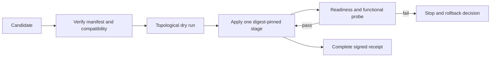

# GRAPHOS-RELEASE-001 — Design and implementation plan

Status: SPECIFIED. Governing [spec](spec.md).

## Existing system and reuse

`graph_os.deployment.genesis_environments` already validates closed release inputs and rejects non-digest-pinned production profiles. `profile_summary` provides a reviewable, secret-free representation. `graph_os.deployment.release_canary` checks the installed GraphOS entrypoints, engine binary and numeric kernel without starting services. `graph_os.deployment.production_ops` owns bounded production operations. `graph_os.deployment.self_deploy` has dry-run, health-gated and rollback-advice semantics. `doctor_certification` checks signed release manifest and compatibility inputs. Reuse these owners; do not introduce a second release manager or copy the pipeline's image builder into GraphOS. The gap is one candidate dependency graph and stage-by-stage served proof.

## Candidate manifest and compatibility

A versioned candidate contains `candidate_id`, `created_at`, `source_revisions`, `artifacts`, `profiles`, `compatibility`, `stages`, and `evidence`. Each artifact has a stable component ID, source repository and full commit SHA, immutable `sha256` image or wheel digest, and public build receipt. A stage names required predecessors and a probe contract. A GraphOS profile refers to the GraphOS artifact digest and its exact profile digest. The manifest signature or trusted provenance is validated before reading deployment inputs. Canonicalize and hash the manifest; record the digest in each stage receipt. Reject duplicate IDs, cycles, missing required edges, unsupported schema, omitted digests, tag-only references and incompatible API/schema ranges. Do not accept a same-tag image as equivalent to a digest.

The pipeline owner produces artifact attestations and the dependency metadata; GraphOS consumes and verifies them. If another owner has not published an exact compatible receipt, GraphOS reports `dependency_unqualified` and leaves the current release active. A local fixture can supply test signatures and fake digests without accessing any external registry.

## Rollout state machine

The topological sort uses only manifest edges, with a stable tie-break by component ID. A typical candidate declares engine before GraphOS, GraphOS before optional WebUI, and each enabled connector according to its engine/agent/SDK dependency; the graph, not a hardcoded sequence, decides. For every stage, compare target's observed digest and profile digest, apply the immutable artifact, then require both readiness and a meaningful function: engine query, agent dispatch, connector capability, GraphOS authenticated MCP `tools/list` and denied request, or WebUI API consumption. Bound waits and include timeout reason. A stage cannot pass from liveness alone.

GraphOS uses its current `setup-config`/profile loader and `doctor` to verify target input before apply. `graph-os-release-canary` proves installed local packaging; an independent served probe exercises the public gateway, identity and engine. Each receipt identifies which tier was actually tested. Do not re-run another owner's tests under a GraphOS label or infer consumer success from producer green.

## Failure and rollback

Before each stage, persist the previous artifact digest, profile digest and stage status in a privacy-safe receipt. On a failure, stop scheduling dependents. Roll back only when the previous immutable artifact and profile are available and the operation is reversible; then repeat readiness and functional probes. If a migration or external effect is irreversible, preserve partial status and require an operator-approved recovery plan. Idempotent retry of the same candidate must not duplicate effects. A new candidate with a different digest needs a new approval and receipt chain.

## Quality and release gates

Required PR checks prove manifest validation, deterministic ordering, profile/digest checks, negative failures and dry-run using disposable fixtures. Release acceptance adds signed artifact/build provenance, hosted integration or cluster test, canary, served GraphOS identity and consumer probes, and rollback drill. Run `uv run pytest`, `uv run ruff check .`, `uv run mypy graph_os`, and `uv build --wheel`; record exact revisions. CCCC cyclomatic ≤10/cognitive ≤15, KISS thresholds from `.kiss/kiss.toml`, and shared `dupehound-changed`, `jscpd-differential`, and `jscpd-census` gates apply to implementation. Keep this orchestration as a small state machine around existing components; no copied build scripts, second config parser, or mutable-tag escape hatch.
