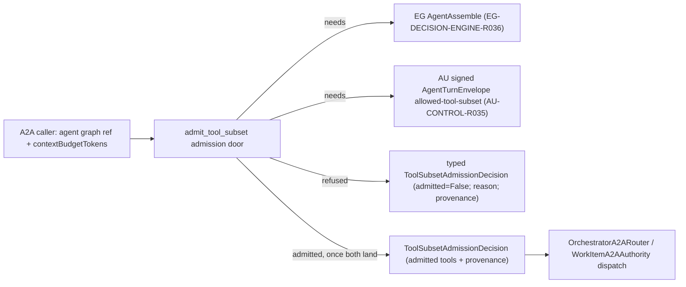

# A2A context-budget tool-subset admission — architecture

Status: **READY FOR IMPLEMENTATION**. Delivery: **NOT ACCEPTED**. Governing [spec](spec.md).

## Existing system and reuse

`graph_os.a2a.models.A2AContextBudget` already carries the caller-declared `contextBudgetTokens` wire field, and `graph_os.a2a.routing.OrchestratorA2ARouter` already fails closed (`A2AAssemblyUnavailable`) whenever a route request carries a non-null `context_budget_tokens`, with an explicit comment naming both upstream gaps: EG `AgentAssemble` is a refusal stub and the signed AU dispatch carrier cannot carry an allowed-tool subset. `graph_os.a2a.authority.WorkItemA2AAuthority._enqueue`/`dispatch` likewise refuse whenever `decision.selected_tools` is non-empty, per `graph_os/a2a/authority.py:242,274`. This spec does not replace that router or authority; it factors the admission decision they both need into one typed, independently testable door: `graph_os.a2a.admission`.

## Architecture

`ToolSubsetAdmissionRequest` and `ToolSubsetAdmissionDecision` (`graph_os/a2a/admission.py`) are typed `pydantic` models reusing the existing `_WireModel` base and `A2AContextBudget` type from `graph_os.a2a.models`, so the wire shape stays consistent with the rest of the A2A facade. `admit_tool_subset` is a pure function: given a request, it returns a decision. Today it always refuses with `EG_ASSEMBLE_UNAVAILABLE`, matching the existing router/authority behavior exactly, because that is the first upstream gap reached. Once EG `AgentAssemble` is callable, the function gains a dependency-injected EG assembly client and a second refusal path, `ENVELOPE_LACKS_ALLOWED_TOOL_SUBSET`, for the remaining AU gap; once both upstreams land, it returns an admitted decision whose `admitted_tools` and `provenance` trace to one committed EG decision record and one signed AU envelope field.

`OrchestratorA2ARouter.route` and `WorkItemA2AAuthority._enqueue`/`dispatch` are updated, in a later increment under this spec, to call `admit_tool_subset` instead of inlining their own `A2AAssemblyUnavailable` raises, so there is exactly one admission authority instead of two duplicated fail-closed checks. That wiring is out of scope for the `GRAPHOS-A2A-002-R001.1` slice delivered now; it is the open remainder under `GRAPHOS-A2A-002-R002`/`R003`.

## Implementation sequence

1. **This PR (`GRAPHOS-A2A-002-R001.1`):** add the typed `ToolSubsetAdmissionRequest`/`ToolSubsetAdmissionDecision` models and the `admit_tool_subset` function returning today's exact fail-closed result; add the refusal unit test; open the spec and the AU owner row (`AU-CONTROL-R035`) this door depends on.
2. Once epistemic-graph publishes a non-stub `AgentAssemble` client, inject it into `admit_tool_subset` and add the `ENVELOPE_LACKS_ALLOWED_TOOL_SUBSET` refusal path for the still-missing AU field.
3. Once agent-utilities lands `AU-CONTROL-R035` (the signed envelope's allowed-tool-subset field) and publishes the updated generated client, wire the admitted path: EG answer in, signed envelope out, with signature verification before any dispatch treats the subset as enforced.
4. Replace `OrchestratorA2ARouter`'s and `WorkItemA2AAuthority`'s inline `A2AAssemblyUnavailable` raises with a call to `admit_tool_subset`, so there is exactly one admission authority.
5. Update [test-spec.md](test-spec.md) coverage for the admitted path and record exact default-branch evidence before changing delivery state.

## Quality and environment

Use `uv sync --extra test`, focused `uv run pytest tests/a2a/test_admission.py`, Ruff, mypy, and the repository's configured pre-commit hooks. No new broker, task store, or duplicate admission authority is introduced. CI fixtures require no external secrets or private network for the model and refusal tests landed in this PR.
