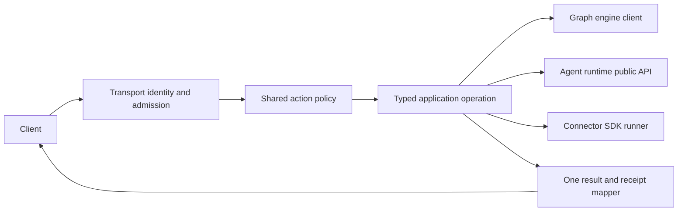

# Architecture and implementation plan

## Existing wiring to reuse

| GraphOS module | Existing responsibility | Required change |
|---|---|---|
| `graph_os.mcp_server.server`, `runtime`, `composition`, `bootstrap` | FastMCP entrypoint, lifecycle and composition | Keep one loop and one multiplexer; move dependency-specific construction behind public ports and fail closed on unavailable contracts. |
| `graph_os.gateway` | REST routes, catalog and widget projection | Adapt routes to the same application operation and authorization decision as MCP; keep vendor calls in admitted fleet tools. |
| `graph_os.a2a` | Agent Card and task projection | Reuse the host application service, never create a task/event store. |
| `graph_os.webui_host` | Optional WebUI co-service | Submit to owner loop; keep browser presentation in the WebUI package. |
| `graph_os.control_plane` | Policy and reconciliation orchestration | Keep hosted decisions here while durable provenance and graph state use the engine client. |
| `graph_os.deployment` | Configuration and operator commands | Reuse one XDG configuration resolver and publicly installable extras. |

`graph_os.mcp_server.bootstrap` and `graph_os.a2a.routing` currently contain dependency-internal imports. Treat them as migration inventory, not approved architecture. A port is a narrow protocol describing the methods GraphOS actually calls; its adapter imports the dependency's supported public API. If a public method is missing, add it to the owning package and pin a released version before deleting the old import. Do not mirror the private implementation in GraphOS.

## Request path

The transport adapter parses and bounds a payload, authenticates identity, applies origin/CSRF requirements where applicable, and constructs an immutable request. `action`, `tenant`, `resource`, `scopes`, `policy_version`, `idempotency_key` and `correlation_id` are typed; the trusted principal comes from transport admission. Policy runs before an effect or delegated call. The operation returns typed data or a typed error; transport adapters only encode them. Redacted structured logs carry the correlation and receipt identity, never secrets.

## Migration sequence

1. Inventory each GraphOS-to-AU import and each duplicate host/module. Label its owner and the public port it needs. Cover eager, lazy and type-only imports.
2. Add missing public dependency ports in their owners and test them through installed wheels. Replace GraphOS call sites by capability, beginning with identity/config, graph client and agent execution; no package-wide compatibility alias.
3. Reconcile gateway, deployment, MCP, fleet, A2A and messaging copies against the public behavior tests. Delete old duplicate script registration after parity.
4. Make owner-loop submission a single service and verify co-service lifecycle, reload and cancellation under concurrent sessions.
5. Run the boundary census and served parity tests on a clean environment; record exact package versions and source hashes in `tasks.md`.

## Design constraints

New adapters remain small and cohesive. Before adding a class, inspect an existing `graph_os.*` port and route; extend the owning module where its contract fits. Avoid duplicate decision trees, hand-maintained action catalogs, hidden fallback authority and broad `except` that turns denial into success. A dependency contract mismatch returns a typed unavailable error and an observable receipt. A temporary migration shim must have one caller, one removal task and a test preventing expansion.

Cross-repository work is sequenced by public package release: engine/SDK/AU contract first, GraphOS adapter second, client projection last. Public dependency versions in `pyproject.toml` and `uv.lock` express the minimum required API; no unpublished sibling path is a required test input.
