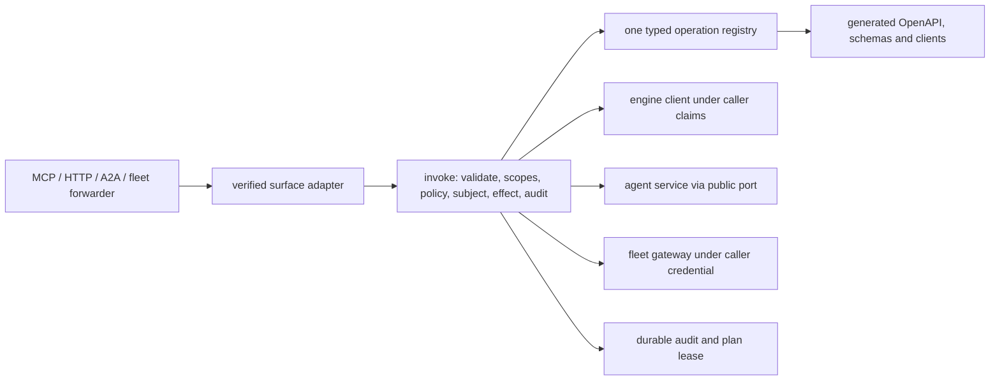

# Hosted API and intent operations — architecture

Status: **READY FOR IMPLEMENTATION**. Delivery: **NOT ACCEPTED**. Governing [spec](spec.md).

## Existing wiring to reuse

`graph_os.mcp_server.runtime` owns the served FastMCP loop, verified session scope, 320-second bounded dispatch, and `runtime.graph_client(tenant)`; `graph_os.gateway.graph_api.register_graph_routes` composes the REST host; `graph_os.fleet.multiplexer` owns per-session loading, forwarding, notifications, and child lifecycle. `graph_os.a2a` already has authenticated unary task methods. `graph_os.webui_host.mcp_delegation` must use the same public invocation boundary. These are migration seams, not new parallel servers. Engine state belongs to `epistemic-graph`; agent decisions/work items to `agent-utilities`; connector effects to the SDK/fleet; GraphOS authenticates, composes, supervises, routes and projects.

## Component and data flow

Use immutable `OpSpec` data grouped by domain. An engine binding is generated from the versioned packaged method schema; a composite binding names a typed GraphOS service function. A curated alias suppresses the corresponding generated `eg.*` op so each wire method has exactly one owner. `Registry.digest` hashes canonical sorted schema and policy metadata. Route/verb factories create a single HTTP and MCP wrapper per operation family, never duplicated per-domain authorization.

The invocation order is: resolve and allowed surface; strict params including authority-field rejection; authenticate; principal kind; exact caller scopes; Eunomia decision; caller-side subject access for service execution; effect preview/confirmation; durable audit reservation for governed effect; execute under caller claims or allowlisted service identity; record outcome; map to one envelope. The service executor stamps the verified caller as record owner, refuses caller-supplied owner, and rechecks authorization before deferred work. A post-effect audit failure returns an indeterminate receipt and reconciliation handle.

## Wire contracts

`POST /api/v1/ops/{op_id}` accepts the operation's JSON schema; `Idempotency-Key` is required for non-natural write ops. `GET /api/v1/registry` is caller-filtered and returns a digest ETag. `GET /api/v1/ops` and OpenAPI expose only public schema metadata; sensitive discovery is filtered per caller. Resource routes, including identity and fleet catalog paths, are generated from `HttpShape` and use the same handler. `Graphos-Plan-Ref` resumes a plan. HTTP preview returns 428 with `CONFIRMATION_REQUIRED` or `STEP_UP_REQUIRED`. MCP returns the same envelope in tool result. `meta.registry_digest` and `meta.api_version` are mandatory.

The resident MCP surface contains the ten names in HO-04. `find` accepts `op` or natural-language `intent`; exact operation IDs and typed params are required before effect. Verb ceilings are enforced (`ask/find/why` read, `write` write, `act` operational effects, `manage` admin). Discovery returns authorized schema descriptors. A bounded cache and tenant/policy-partitioned outcome ranking may improve suggestions but must never turn fuzzy text into an unconfirmed mutation. Fleet `find_tools` pages one catalog; `load_tools` mounts a child tool as `<server>__<tool>`, a prompt/resource/skill in its native MCP form, or returns an SDK item pointer. Native child forwarding calls `invoke("fleet.call", ...)`; no transport calls bypass it. The child call uses the caller's delegated credential or a declared service-execution rule with the same deputy checks. `ToolAnnotations` classify read/destructive effects; unannotated means write; a reviewed manifest can tighten to admin.

Scopes are exact. `mcp:discover` and `mcp:delegate` do not imply each other; `mcp:admin` is not a super-scope. `finance:read`, `fleet:read/control`, `loops:read/control`, `ops:read/admin` and every operation scope must exist in the public engine registry. `EUNOMIA_TYPE=off` still enforces scopes; enabled PDP failure returns `POLICY_UNAVAILABLE`. Decisions cache at most 30 seconds by principal, revision, item, action; admin/destructive are uncached. A revision invalidates loaded visibility and sends list-change notifications. The enabled/disabled mode behavior is testable with an in-process fixture PDP.

Error source is `engine`, `fleet`, or `graphos`. Engine error codes pass through unchanged from the packaged error contract; GraphOS owns one mapping table for its closed enum. Details may include missing public scope names or a public target name, never secrets or private actor/tenant values. Timeouts and unknown outcomes remain typed errors. Stable API compatibility is checked against the merge base of public generated registry artifacts.

## Migration and implementation order

1. Pin a public engine wheel that ships method/error/scope schemas; add registry data and direct bindings; check exact coverage and exclusions.
2. Add invocation, policy, error, audit-reservation, and plan-lease services with fixture-backed tests. Reuse verified-session middleware and current server/client composition.
3. Add MCP verbs, multi-kind fleet adapters, HTTP factory and generated clients. Build one end-to-end vertical slice before expanding domain op tables.
4. Add each domain family by moving handlers out of existing registrars. For missing upstream methods, make a typed unavailable op and defer advertisement until a released contract exists.
5. In one integration change, mount the ten resident tools and `/api/v1`, route loaded forwarders through `invoke`, migrate consumers, delete duplicate registrars/routes and stale instructions. Keep one owner loop and one multiplexer instance.
6. Run [test-spec.md](test-spec.md), publish exact revision evidence, then mark individual capabilities `ACCEPTED`.

The retirement inventory is a checked artifact produced from the existing host registration table and the new registry. Each prior tool/route is labeled `mapped` with its new op ID or `dropped` with a reason and consumer search result. The cutover check enumerates FastMCP tools, Starlette routes and A2A methods at runtime and rejects undeclared extras. It also scans source for ad hoc `mcp.tool`, route registration, and child transport dispatch outside the approved factories. A transition is atomic for supported callers: generated client release, server mount, caller migration and old endpoint removal are reviewed together; no permanent fallback dispatcher remains. External clients receive v1 contract and migration note before stable path removal.

## Fresh-checkout and quality design

`uv sync --extra test`, `uv run pytest tests/api tests/fleet`, `uv run ruff check .`, `uv run ruff format --check .`, and `uv run mypy graph_os` must run with public pinned wheels and fixture identities. CI may provision an ephemeral local engine/agent stack for served tests; no check requires a private host or credential. Existing repository hooks provide CCCC, KISS, jscpd and Dupehound scanning; the scoped implementation must satisfy configured thresholds (including zero new clone pairs), not lower or suppress them. Keep registry domain tables small, use a step table rather than nested branching, one endpoint factory per surface, and generated declarative types rather than repeated function bodies. Delete old implementation in the cutover so scanners and reviewers see one authority.

## Gateway carry-over: dashboard, Live Artifacts, widget (folded from GRAPHOS-GWC, 2026-10-11)

Cross-repo IDs: AU-BOUNDARY-R001.2, AU-BOUNDARY-R001.3, AU-BOUNDARY-R001.7 (agent-utilities deletions); GRAPHOS-HOST-R005. Provenance: agent-utilities commits 0eb67c99c (dashboard router), 902f906ca (Live Artifacts router), 7717d2e62 (genius_agent widget).

Deleted dashboard router (prefix `/api/dashboard`, read capability on every route except `/health`; write capability on mutations; capabilities gateway:read, gateway:write, gateway:admin, admin; API-key callers unrestricted):
- GET `/layout` and PUT `/layout`: read and persist the dashboard layout (shared YAML, reads always go back to disk).
- GET `/data`, GET `/data/{service_id}`: widget data for all or one service; the id must match a safe pattern, unknown service returns 404.
- GET `/full`: layout and data in one call. GET `/data-subset?widget_id=...`: only the named widgets, fetched concurrently, never computing unsubscribed ones.
- GET `/widgets`: widget types available. GET `/discover`: layout auto-discovered from the MCP config.
- GET `/health`: always 200 with the shared truthful health report, `Cache-Control: no-store`.
- GET `/daemon/status`, GET `/daemon/shards`, POST `/daemon/start`: consolidated background daemon state, engine shard topology and reachability, ensure daemon running.
- POST `/hydrate/{source}`, POST `/hydrate`, GET `/hydration-status`: trigger hydration for one or all sources, and read source status; 422 on a malformed source, 500 when no active engine, sanitized error payloads.

Deleted Live Artifacts router (no router-level auth in the old module):
- POST `/api/artifacts`: create from name, template, data, source query, source node ids and model; provenance records model, query and evidence ids; bounded-JSON violation returns 400; response is artifact id and rendered output.
- GET `/api/artifacts/{artifact_id}`: full artifact, 404 when absent.
- POST `/api/artifacts/{artifact_id}/refresh`: with inline `data` the body becomes the new derivation; otherwise a registered source resolver re-derives from the graph (the default resolver preserved prior data). Returns ok, reason and rendered output; 404 when absent; a failed refresh preserves the prior render.
- Stores: the shared Live Artifact store and refresh service, a module singleton. Caller: `server/app.py` mount only; the KG source installer was deleted with the router.

Deleted Genius Agent widget: dashboard tile (type genius_agent, env prefix GENIUS_AGENT, observability category) with fields agents, skills, mcp_tools and status. Its fetch returned hardcoded numbers and never contacted anything.

### Design in this repository

- Dashboard: owned by the existing dashboard router module and its aggregator, config manager and registry under the gateway package. No new module; add census and capability tests only.
- Live Artifacts: new router module `graph_os/gateway/artifacts_api.py` (to be created) with typed request model, a store port and a refresh port declared in the gateway ports module, and a register function that mounts the three routes. The store and refresh service come from a public `agent_utilities.api` export (prerequisite row); graph-os never imports the agent-utilities knowledge-graph package directly.
- The source resolver is a port argument, not a module global: the host passes a graph-backed resolver, default behaviour is preserve-prior-data.
- Genius Agent widget: nothing to build.

### Wiring

- Dashboard: the register function in the dashboard router module mounts routes and the websocket; already called by the host.
- Artifacts: a new register function is called from the same host composition point that mounts the graph and usage routes. Authentication: reuse the dashboard capability dependencies unchanged (decision D3 below: gateway:read for GET, gateway:write for POST, plus the gateway:admin and admin supersets). These are identity capabilities, not engine registry scopes. The old router had no router-level check, so this is an intentional tightening, called out in the parity table.
- Config: the artifact store location follows the agent-utilities store default; no new env key.

Out of scope:

Moving the Live Artifact store or refresh service out of agent-utilities, new dashboard widgets, any change to the layout file format, and the MCP tool surface for artifacts (the research-artifact tool is unrelated).

### Caveat resolutions (design, 2026-10-10)

#### D2 Dashboard route parity (CONFIRMED by reading both files)

Compared `git show 0eb67c99c^:agent_utilities/gateway/api.py` (328 lines) with `graph_os/gateway/dashboard_api.py` (389 lines). Both define the same 15 REST routes. The only addition is the websocket `/ws/dashboard` (moved from agent-webui; not part of the old router). Shared helpers are line-for-line equal: `_SERVICE_ID_RE`, the read and write capability sets (`gateway:read`, `gateway:write`, `gateway:admin`, `admin`; write excludes `gateway:read`), API-key callers unrestricted, the `/health` exemption in the read dependency, fail-closed 403 when capability resolution raises, and `Cache-Control: no-store` on health. Supporting modules differ only in import paths, a naive-UTC `_naive_utcnow` replacing deprecated `datetime.utcnow` in `models.py` (same value), and a new service-session in `aggregator.py`.

| Method and path | Auth | Request / response shape | Refusals | Result |
|---|---|---|---|---|
| GET /layout | read | none / `DashboardLayout` | 403 | CONFIRMED-equal |
| PUT /layout | write | `DashboardLayout` / `{"status":"saved"}` | 403 (write), 422 (body) | CONFIRMED-equal |
| GET /data | read | none / `dict[str, WidgetData]` | 403 | CONFIRMED-equal |
| GET /data/{service_id} | read | none / `WidgetData` | 403; 404 on bad id or "not found" error | CONFIRMED-equal |
| GET /full | read | none / `DashboardResponse` | 403 | CONFIRMED-equal |
| GET /data-subset | read | repeated `widget_id` / `dict[str, WidgetData]`; default `[]` became `None` and `set(widget_id or ())`, same empty result | 403 | CONFIRMED-equal |
| GET /widgets | read | none / `list[WidgetListItem]` | 403 | DIFFERS: same shape, but the registry module map lives in `graph_os/gateway/registry.py`; the set of widget types is not compared in any test (row R001.8) |
| GET /health | none | none / health report | none (always 200) | CONFIRMED-equal |
| GET /discover | read | none / `DashboardLayout` | 403 | CONFIRMED-equal |
| GET /daemon/status | read | none / daemon status dict | 403 | DIFFERS: now `graph_os.gateway.daemon.daemon_status`; the module was refactored and its key set is not pinned (row R001.5) |
| GET /daemon/shards | read | none / shard topology dict | 403 | DIFFERS: same wire; still imports `agent_utilities.knowledge_graph.core.shard_topology`, an internal module (row R001.6) |
| POST /daemon/start | write | none / daemon status dict | 403 | DIFFERS: same as /daemon/status (row R001.5) |
| POST /hydrate/{source} | write | none / hydration result dict | 403, 422 bad source, 500 no engine, 400 `ValueError`, 500 sanitized | DIFFERS: refusal codes equal; engine and hydration come from AU internal modules (row R001.7) |
| POST /hydrate | write | none / hydration result dict | 403, 500 no engine, 500 sanitized | DIFFERS: same (row R001.7) |
| GET /hydration-status | read | none / status dict | 403 | DIFFERS: same (row R001.7) |

No route is MISSING. The capability resolver itself still imports `agent_utilities.core.config` and `agent_utilities.security.identity` (internal modules): DIFFERS in dependency only (row R001.9). Decision on the shard, hydration and active-engine dependency (DECIDED): use the engine client session and source-sync methods that `GRAPHOS-HOST-R002` already requires, not a new public `agent_utilities.api` export, because hydration and shard state are engine concerns. Row R001.6 first adds a contract test that the installed client exposes them; if it does not, the row is BLOCKED on the engine client owner and the route keeps its present imports.

#### D3 Live Artifacts authentication (DECIDED; not blocked)

Evidence: `graph_os/api/registry/scopes.py` exports `FinanceScope`, `FleetScope`, `LoopsScope`, `OpsScope`; `graph_os/api/policy/domain_scopes.py` lists `fleet:events` and `webui:{admin,maintainer,reader,user}`. The pinned engine `contract/scopes.json` (175 rows, the file `eg_binding._load_scopes` reads and `tests/api/test_registry_factory.py` checks for "unregistered EG scope") has no `gateway:*` row. So `gateway:read` and `gateway:write` are NOT registry scopes. They are identity capabilities that the dashboard resolves from the identity group capability map (`_dashboard_capabilities`). The earlier text calling them "already in the engine contract" was wrong and is corrected above.

Decision: the artifact routes use the same dependencies as the dashboard routes (`_require_dashboard_read` for GET, `_require_dashboard_write` for POST, reused from `dashboard_api.py`, not copied), so behaviour matches sibling routes and no engine change is needed. Gateway scopes do NOT need adding to the engine: `EG-IDENTITY-R007` (which registers `identity:admin`, `loops:read`, `loops:control`) is unrelated, and `loops:*` are likewise absent from the pinned `scopes.json` today, which is that row's concern, not this one. I could not locate the R007 row text in the epistemic-graph specs checkout on this host, so its exact wording is unverified here. Alternative rejected: map to registry scopes `webui:reader`/`webui:user`; those are the WebUI role namespace and would create a second authorization model for one gateway.

#### D4 Agent-utilities export for artifacts (CONFIRMED; proposed AU row)

Read `agent_utilities/knowledge_graph/live_artifacts/`. Public names: `LiveArtifact`, `Provenance`, `BoundedJSONError`, `validate_bounded_json`, `render_template` (models.py); `LiveArtifactStore`, `get_live_artifact_store`, `ArtifactWriter` (store.py); `RefreshService`, `RefreshResult`, `DataSource` (refresh.py); `kg_source_resolver` (kg_source.py). `install_kg_artifact_source` imports the deleted `agent_utilities.gateway.artifacts_api` and always logs a failure; it must not be exported.

Proposed agent-utilities row (orchestrator adds it; new file `agent_utilities/api/live_artifacts.py`, re-exported from `agent_utilities/api/__init__.py`):

> `AU-BOUNDARY-R013.<n>` **Export the Live Artifact store, models and refresh service.** Re-export `LiveArtifact`, `Provenance`, `BoundedJSONError`, `validate_bounded_json`, `LiveArtifactStore`, `get_live_artifact_store`, `RefreshService`, `RefreshResult`, `DataSource` and `kg_source_resolver` from `agent_utilities.knowledge_graph.live_artifacts` through `agent_utilities.api.live_artifacts`; delete the dead `install_kg_artifact_source`. Verification: an agent-utilities test imports each name from `agent_utilities.api` and the layout fence still passes.

Because the AU resolver already re-runs `source_query`, GRAPHOS-OPS-R040.8 wires `kg_source_resolver` instead of re-implementing it (no parallel function). The bounded-JSON limits (depth 8, 100 keys, 500 items, 16 KiB string, 256 KiB total) stay in the AU validator; the graph-os request model does not copy them.

## Audit record

Dashboard route parity audit (method: compare the deleted router with the served one, route by route; result below; see D2 above for the per-route table).

| Old entry point | New entry point | Status | Reason |
|---|---|---|---|
| GET /api/dashboard/layout, PUT /layout | dashboard router same paths | exists | verify with a test |
| GET /data, /data/{service_id}, /full, /data-subset | dashboard router same paths | exists | verify with a test |
| GET /widgets, /discover, /health | dashboard router same paths | exists | verify with a test |
| GET /daemon/status, /daemon/shards, POST /daemon/start | dashboard router same paths | exists | verify with a test |
| POST /hydrate/{source}, POST /hydrate, GET /hydration-status | dashboard router same paths | exists | verify with a test |
| websocket /ws/dashboard (consumer of the subset fetch) | dashboard websocket | exists | verify with a test |
| fetch_dashboard_subset (Python helper) | aggregator fetch via /data-subset | exists | helper removed upstream with its test |
| POST /api/artifacts | artifacts router | to build | no equivalent found in graph-os |
| GET /api/artifacts/{id} | artifacts router | to build | no equivalent found |
| POST /api/artifacts/{id}/refresh | artifacts router | to build | no equivalent found |
| register_artifact_source | resolver port argument | to build | replaces a module global |
| genius_agent widget | none | intentionally dropped | constant fabricated data; fleet and catalog surfaces report real counts |

## Amendments

### 2026-10-11 Fold of GRAPHOS-GWC into GRAPHOS-OPS

Old statement: the gateway carry-over was a separate spec `GRAPHOS-GWC`. New statement: its three rollups are `GRAPHOS-OPS-R039` (dashboard route parity), `GRAPHOS-OPS-R040` (Live Artifacts routes and their authentication) and `GRAPHOS-OPS-R041` (Genius Agent widget dropped); the host HTTP surface is owned here. Evidence: rows moved unchanged in text; no row was LANDED or VERIFIED.

| Old ID | New ID |
|---|---|
| `GRAPHOS-GWC-R001` | `GRAPHOS-OPS-R039` |
| `GRAPHOS-GWC-R001.1` | `GRAPHOS-OPS-R039.1` |
| `GRAPHOS-GWC-R001.2` | `GRAPHOS-OPS-R039.2` |
| `GRAPHOS-GWC-R001.3` | `GRAPHOS-OPS-R039.3` |
| `GRAPHOS-GWC-R001.4` | `GRAPHOS-OPS-R039.4` |
| `GRAPHOS-GWC-R001.5` | `GRAPHOS-OPS-R039.5` |
| `GRAPHOS-GWC-R001.6` | `GRAPHOS-OPS-R039.6` |
| `GRAPHOS-GWC-R001.7` | `GRAPHOS-OPS-R039.7` |
| `GRAPHOS-GWC-R001.8` | `GRAPHOS-OPS-R039.8` |
| `GRAPHOS-GWC-R001.9` | `GRAPHOS-OPS-R039.9` |
| `GRAPHOS-GWC-R002` | `GRAPHOS-OPS-R040` |
| `GRAPHOS-GWC-R002.1` | `GRAPHOS-OPS-R040.1` |
| `GRAPHOS-GWC-R002.10` | `GRAPHOS-OPS-R040.10` |
| `GRAPHOS-GWC-R002.2` | `GRAPHOS-OPS-R040.2` |
| `GRAPHOS-GWC-R002.3` | `GRAPHOS-OPS-R040.3` |
| `GRAPHOS-GWC-R002.4` | `GRAPHOS-OPS-R040.4` |
| `GRAPHOS-GWC-R002.5` | `GRAPHOS-OPS-R040.5` |
| `GRAPHOS-GWC-R002.6` | `GRAPHOS-OPS-R040.6` |
| `GRAPHOS-GWC-R002.7` | `GRAPHOS-OPS-R040.7` |
| `GRAPHOS-GRAPHOS-OPS-R040.8` | `GRAPHOS-OPS-R040.8` |
| `GRAPHOS-GWC-R002.9` | `GRAPHOS-OPS-R040.9` |
| `GRAPHOS-GWC-R003` | `GRAPHOS-OPS-R041` |
| `GRAPHOS-GWC-R003.1` | `GRAPHOS-OPS-R041.1` |
| `T-001` | `HO-T14` |
| `T-002` | `HO-T15` |
| `T-003` | `HO-T16` |
| `T-004` | `HO-T17` |
| `T-005` | `HO-T18` |
| `T-006` | `HO-T19` |
| `T-007` | `HO-T20` |
| `T-008` | `HO-T21` |
