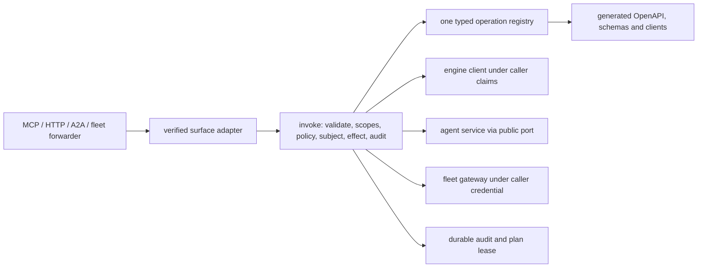

# Hosted API and intent operations — architecture

Status: **READY FOR IMPLEMENTATION**. Delivery: **NOT ACCEPTED**. Governing [spec](spec.md).

## Existing wiring to reuse

`graph_os.mcp_server.runtime` owns the served FastMCP loop, verified session scope, 320-second bounded dispatch, and `runtime.graph_client(tenant)`; `graph_os.gateway.graph_api.register_graph_routes` composes the REST host; `graph_os.fleet.multiplexer` owns per-session loading, forwarding, notifications, and child lifecycle. `graph_os.a2a` already has authenticated unary task methods. `graph_os.webui_host.mcp_delegation` must use the same public invocation boundary. These are migration seams, not new parallel servers. Engine state belongs to `epistemic-graph`; agent decisions/work items to `agent-utilities`; connector effects to the SDK/fleet; GraphOS authenticates, composes, supervises, routes and projects.

## Component and data flow

Use immutable `OpSpec` data grouped by domain. An engine binding is generated from the versioned packaged method schema; a composite binding names a typed GraphOS service function. A curated alias suppresses the corresponding generated `eg.*` op so each wire method has exactly one owner. `Registry.digest` hashes canonical sorted schema and policy metadata. Route/verb factories create a single HTTP and MCP wrapper per operation family, never duplicated per-domain authorization.

The invocation order is: resolve and allowed surface; strict params including authority-field rejection; authenticate; principal kind; exact caller scopes; Eunomia decision; caller-side subject access for service execution; effect preview/confirmation; durable audit reservation for governed effect; execute under caller claims or allowlisted service identity; record outcome; map to one envelope. The service executor stamps the verified caller as record owner, refuses caller-supplied owner, and rechecks authorization before deferred work. A post-effect audit failure returns an indeterminate receipt and reconciliation handle.

## Wire contracts

`POST /api/v1/ops/{op_id}` accepts the operation's JSON schema; `Idempotency-Key` is required for non-natural write ops. `GET /api/v1/registry` is caller-filtered and returns a digest ETag. `GET /api/v1/ops` and OpenAPI expose only public schema metadata; sensitive discovery is filtered per caller. Resource routes, including identity and fleet catalog paths, are generated from `HttpShape` and use the same handler. `Graphos-Plan-Ref` resumes a plan. HTTP preview returns 428 with `CONFIRMATION_REQUIRED` or `STEP_UP_REQUIRED`. MCP returns the same envelope in tool result. `meta.registry_digest` and `meta.api_version` are mandatory.

The resident MCP surface contains the ten names in HO-04. `find` accepts `op` or natural-language `intent`; exact operation IDs and typed params are required before effect. Verb ceilings are enforced (`ask/find/why` read, `write` write, `act` operational effects, `manage` admin). Discovery returns authorized schema descriptors. A bounded cache and tenant/policy-partitioned outcome ranking may improve suggestions but must never turn fuzzy text into an unconfirmed mutation. Fleet `find_tools` pages one catalog; `load_tools` mounts a child tool as `<server>__<tool>`, a prompt/resource/skill in its native MCP form, or returns an SDK item pointer. Native child forwarding calls `invoke("fleet.call", ...)`; no transport calls bypass it. The child call uses the caller's delegated credential or a declared service-execution rule with the same deputy checks. `ToolAnnotations` classify read/destructive effects; unannotated means write; a reviewed manifest can tighten to admin.

Scopes are exact. `mcp:discover` and `mcp:delegate` do not imply each other; `mcp:admin` is not a super-scope. `finance:read`, `fleet:read/control`, `loops:read/control`, `ops:read/admin` and every operation scope must exist in the public engine registry. `EUNOMIA_TYPE=off` still enforces scopes; enabled PDP failure returns `POLICY_UNAVAILABLE`. Decisions cache at most 30 seconds by principal, revision, item, action; admin/destructive are uncached. A revision invalidates loaded visibility and sends list-change notifications. The enabled/disabled mode behavior is testable with an in-process fixture PDP.

Error source is `engine`, `fleet`, or `graphos`. Engine error codes pass through unchanged from the packaged error contract; GraphOS owns one mapping table for its closed enum. Details may include missing public scope names or a public target name, never secrets or private actor/tenant values. Timeouts and unknown outcomes remain typed errors. Stable API compatibility is checked against the merge base of public generated registry artifacts.

## Migration and implementation order

1. Pin a public engine wheel that ships method/error/scope schemas; add registry data and direct bindings; check exact coverage and exclusions.
2. Add invocation, policy, error, audit-reservation, and plan-lease services with fixture-backed tests. Reuse verified-session middleware and current server/client composition.
3. Add MCP verbs, multi-kind fleet adapters, HTTP factory and generated clients. Build one end-to-end vertical slice before expanding domain op tables.
4. Add each domain family by moving handlers out of existing registrars. For missing upstream methods, make a typed unavailable op and defer advertisement until a released contract exists.
5. In one integration change, mount the ten resident tools and `/api/v1`, route loaded forwarders through `invoke`, migrate consumers, delete duplicate registrars/routes and stale instructions. Keep one owner loop and one multiplexer instance.
6. Run [test-spec.md](test-spec.md), publish exact revision evidence, then mark individual capabilities `ACCEPTED`.

The retirement inventory is a checked artifact produced from the existing host registration table and the new registry. Each prior tool/route is labeled `mapped` with its new op ID or `dropped` with a reason and consumer search result. The cutover check enumerates FastMCP tools, Starlette routes and A2A methods at runtime and rejects undeclared extras. It also scans source for ad hoc `mcp.tool`, route registration, and child transport dispatch outside the approved factories. A transition is atomic for supported callers: generated client release, server mount, caller migration and old endpoint removal are reviewed together; no permanent fallback dispatcher remains. External clients receive v1 contract and migration note before stable path removal.

## Fresh-checkout and quality design

`uv sync --extra test`, `uv run pytest tests/api tests/fleet`, `uv run ruff check .`, `uv run ruff format --check .`, and `uv run mypy graph_os` must run with public pinned wheels and fixture identities. CI may provision an ephemeral local engine/agent stack for served tests; no check requires a private host or credential. Existing repository hooks provide CCCC, KISS, jscpd and Dupehound scanning; the scoped implementation must satisfy configured thresholds (including zero new clone pairs), not lower or suppress them. Keep registry domain tables small, use a step table rather than nested branching, one endpoint factory per surface, and generated declarative types rather than repeated function bodies. Delete old implementation in the cutover so scanners and reviewers see one authority.
