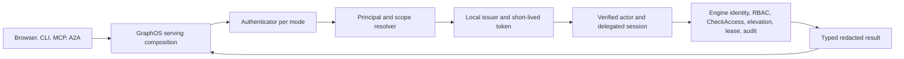

# Design — GRAPHOS-IDENTITY-ACCESS

## Current seam and implementation boundary

This checkout's `graph_os/mcp_server/server.py` and `runtime.py` compose the one FastMCP server and verified tool session; `bootstrap.py` keeps process authority alive. `graph_os/gateway/graph_api.py` installs the existing actor identity middleware. `graph_os/gateway/remote_oauth_api.py` already narrows delegated provider scopes. `graph_os/deployment/cli.py`, `config_generator.py` and `doctor.py` own deployment commands and diagnostics. `graph_os/webui_host/webui_co_service.py` hosts the browser co-service. `graph_os/a2a/authority.py` is the A2A authority boundary. Reuse these. The proposed `graph_os/identity/`, `graph_os/access/`, and `graph_os/api/ops/` packages are **not in this checkout**; implementation must add them and wire them into the serving root before marking an operation available.

The engine is the durable identity and access authority. GraphOS adapters call its typed public methods; they do not write a local identity SQL store. Use the existing gateway session resolution and MCP authority scope, then expose the same application service through REST/MCP/CLI. `stdio` is a transport, not an authorization exemption.

## Ports and composition

Define small protocols in `graph_os.identity.ports`: `IdentityAuthority` (typed engine identity operations, mode CAS, RBAC decision), `SigningKeyStore` (load/rotate by key ID), `ExternalAuthenticator` (verify and resolve), `SessionStore` (engine-backed opaque session operations), `NotificationPort`, and `Clock`. DTOs carry only redacted public fields and typed error/reason codes. `graph_os.access.service` depends on an `AccessAuthority` protocol with request/approve/deny/revoke/check/explain/lease methods. The `mcp_server` serving composition creates the concrete adapters once and injects them into gateway, web host, CLI command factory, and MCP registry. Keep `webui_host` and MCP packages importing ports, not each other. Dependency inversion must clear the configured KISS indirect dependency threshold without increasing that threshold.

When a required engine method is absent, the adapter returns `UNAVAILABLE`, omits the operation from advertised capability discovery where safe, and emits a readiness reason. It never emulates RBAC, lease, or approval locally. The CLI can use the same factory with a local engine fixture. Mock ports support all ordinary PR tests.

The authentication cutover is ordered: construct a signed local-issuer token at the serving root; carry it through every engine client path, including bootstrap, REST, MCP, A2A, CLI and background service calls; prove authorized and denied behavior with the engine verifier; then remove the engine's unauthenticated opt-out. GraphOS must never retry an unsigned envelope after a token error or denial. During rolling deployment, an old client that cannot supply a token fails closed and reports a readiness error; it does not silently switch transport or bypass verification.

## Identity data and mode machine

The engine's reserved identity catalog contains `identity_config` (`mode`, `local_fallback`, policy, `epoch`, active `kid`), users keyed by opaque principal ID, credential/session/refresh/one-time-token hashes, MFA credentials, API keys, roles, groups, provider configs, mapping rules, external identity links, throttle counters and hash-chained audit. GraphOS receives redacted DTOs only. Principal IDs never change when a user adds or removes an authenticator. Each mode uses the same issuer, scope projection and engine decision path.

Allowed transitions: `none→local` requires an administrator with local credential; `none/local→external` requires an enabled provider and linked administrator; `external→local` requires local credentials for every administrator; `any→none` requires loopback bind, explicit acknowledgment, `identity:admin`, and fresh MFA. The engine checks each precondition and epoch atomically. Transition rotates issuer/session keys, revokes browser and refresh sessions, and preserves users, links, grants and owned data. Leaving `none` removes the previous signing key immediately; other rotations may retain old public keys for at most one access-token lifetime. Configuration seeds initial mode only; durable mode wins thereafter and doctor reports drift.

In `none`, bootstrap principal is a normal engine principal with scoped admin grants but no approver/live-order membership. Every request still carries a valid signed token into engine RBAC. Network exposure requires an explicit acknowledgment, exact Host allowlist, and Origin check for cookie mutations. Show mode in session/status/MCP initialize and doctor. Local mode uses 256-bit opaque server-side session IDs stored only by hash, `__Host-graphos_session` with Secure/HttpOnly/SameSite=Lax/Path=/, CSRF token, fixation rotation, idle/absolute expiry and revocation. Access tokens live at most five minutes. Password candidates and recovery codes go only to engine verification methods; GraphOS never logs them. Privileged console mutation requires `identity:admin`, operator-console origin, and MFA age at most 15 minutes. MFA enrollment itself is optional unless a group policy requires it.

## Public interface contract

All REST mutations use JSON, an idempotency key where replay could create an object, and the current mode epoch or resource version. Errors use `{code,message,request_id}` with stable codes `UNAUTHENTICATED`, `FORBIDDEN`, `MFA_REQUIRED`, `CSRF_INVALID`, `CONFLICT`, `RATE_LIMITED`, `UNAVAILABLE`, `INVALID_INPUT`; a public error never confirms whether an account exists. Inputs have strict size limits, UUID/ID grammar, and no arbitrary engine method name.

| Surface | Contract | Authorization |
|---|---|---|
| `GET /.well-known/openid-configuration`, `GET /.well-known/jwks.json` | Issuer, supported signing algorithm and active/overlap `kid`; no private key. | Public read with bounded rate. |
| `GET /auth/session`, `POST /auth/{login,logout,register,forgot,reset,change-password}`, `POST /auth/mfa/{totp,webauthn,recovery}` | Current principal/mode and ceremony state; one-use challenges; logout revokes server session. | Ceremony-specific CSRF, Origin, throttling. |
| `/api/identity/self`, `/api/identity/users`, `/api/identity/sessions`, `/api/identity/keys`, `/api/identity/service-accounts`, `/api/identity/roles`, `/api/identity/groups` | Redacted list/get/create/update/revoke operations; deterministic pagination. | Self routes limited to own record; admin mutation requires exact scope, console and fresh MFA. |
| `/api/identity/idps`, `/api/identity/mappings/dry-run`, `/api/identity/policy`, `/api/identity/mode`, `/api/identity/issuer`, `/api/identity/audit` | Provider configuration, deterministic role preview, policy CAS, mode transition, rotation and audit export. | Admin rules as above; secret refs only, never secret values. |
| `/scim/v2/{Users,Groups,ServiceProviderConfig,Schemas,ResourceTypes}` | SCIM 2.0 bearer bound to one provider; PATCH and `eq` filter; deprovision revokes access without deleting ownership. | Exact `identity:provision` service credential. |
| `/api/access/{requests,approvals,leases,check,explain}` and operation registry `access.*` | Typed engine-backed elevation and access decisions with reason codes and audit receipt. | Exact scope per operation; requester cannot approve own request; delegated sessions cannot approve. |
| `graph-os identity {claim,link-claim,transition,reset-admin,rotate}` | Human-readable result and machine-readable error code; one-time material printed once, never logged. | Local socket/service credential plus required actor and step-up. |

The MCP `identity.*` twin is read and low-risk self service only. Identity admin, scope grants, provider edits, mode changes, and approvals are console-only. An MCP catalog entry must state required exact scope. `fleet:*`, `mcp:*`, `ops:*`, and other registry names are not inferred from `admin` or `kg:admin`. Unknown native tools are denied and omitted. Agent delegation preserves the principal/tenant/scope ceiling and never adds approval authority.

## External adapters

OIDC validates discovery metadata, issuer/audience/signature, `state`/`nonce`, PKCE S256 and callback binding. Ordered mappings union matching targets; no match grants only the base user role under JIT-create, or denies under JIT-deny. Source-tagged memberships are replaced on every login/sync while local grants remain. Link by verified email is off unless explicitly enabled per provider. Logout uses `id_token_hint` where supported. LDAP accepts LDAPS or StartTLS only, escapes RFC 4515 filters, bounds recursion and paging, and deprovisions disabled users. SCIM binds each token to one provider. SAML is brokered through an OIDC provider initially, so GraphOS does not parse XML signatures. SMTP is optional; with no adapter, email-only routes and UI options are unavailable. All external adapters have deterministic local test doubles.

## Decisions, failure modes, and observability

One engine-backed authority eliminates local/engine disagreement. Unavailable engine or secrets store means login/identity mutation fail closed. Bad signing key, unknown `kid`, wrong tenant/audience, stale epoch, revoked credential, denied scope, and unavailable external IdP produce distinct internal reason codes but safe public messages. Emit metrics for issuance, login failures, mode transitions, denied access and adapter availability without subject, token, password or raw IP labels. Audit all privileged identity/access changes and sampled denials through engine authority. No readiness gate needs an existing external provider; optional live-provider qualification is a separate deployment exercise.

## Implementation order

1. Freeze typed engine/GraphOS DTOs and error codes; add local engine fixture and contract tests.
2. Add ports and one serving composition root, then issuer and `none` path.
3. Add local sessions, account recovery, MFA and API keys.
4. Add identity/access operations and exact scope registry wiring; only then advertise routes.
5. Add OIDC/LDAP/SCIM/brokered SAML/optional SMTP adapters and CLI/doctor.
6. Run the three-mode decision oracle, browser/MCP/CLI flows, scanner and release gates; record exact evidence.

## Bounded producer implementation

`identity.engine` parses and freezes the authoritative response shape;
`identity.issuer` prepares consistent local claims and narrowed context and
signs through the existing read-only secret-backed key-ring port. Its injected
credential authority is checked before signing and again before returning the
token. It never generates, writes or rotates a deployment key or grants broker
authority. `identity.browser` validates exact cookie/Origin/CSRF transport and
captures private immutable request bindings. These source components are not
a mounted authentication implementation.

The serving composition must still inject qualified EG credential resolution,
current policy, source expiry, an existing broker and signing authority. Browser
session reference/expiry/MFA fields require a separately qualified EG response.
No adapter may invent those fields or use a bare user lookup. Until the public
generated binding and actual owners supply them, issuance and browser admission
remain unavailable. Use the existing WebUI evidence class and C adapter; E must
supply the exact caller-session instance bound by the producer. If scope-only
verification cannot enforce that pairing, revise the C-owned interface before
activation. No self-minted broker or parked implementation fallback is present.

The EG public source DTO is `IdentityReply<RequestContextClaims>` with
`PrincipalResolution<RequestContextClaims>` at `kind=resolution/value`.
GraphOS rejects a missing or null `request_context`, including the internal
`PrincipalResolution<()>` shape. Optional context `node` and `priority` may be
omitted or null; neither becomes identity authority. The public resolution
context does not yet supply source credential expiry or browser-session proof;
these remain separate required authority inputs, never guessed from the policy
version or a successful context parse. Source-aligned synthetic wire fixtures
are not evidence that Rust serialization or generated bindings ran.

`identity.ports` defines injected composition facts with mandatory source expiry;
these are not new EG wire fields or a replacement WebUI evidence DTO.
`UnavailableIdentityAuthority` explicitly refuses until qualified EG adapters
supply those facts. `GraphOSBrowserAuthority` implements the existing WebUI port
using a private per-request registry, exact caller-session instance, original
credential and forwarded-token pairing. It checks snapshots after awaited
owner calls, rechecks current authority before exporting evidence, and removes
bindings on rotation/refusal/cancellation or context-manager exit. Refresh must
invalidate the old binding before establishing a new one.

E owns the integration sequence: enter `BrowserAdmission.request` with the
original request; this producer rejects incoming cookie-plus-bearer ambiguity,
issues the token from that exact cookie and obtains C's current caller session
from that token before creating a private binding. Hand its returned normalized
scope to C, inject this owner's `session_for_request` into C and this owner as
the WebUI authority; call `before_invocation` with
the resulting exact caller session immediately before dispatch; exit the
context manager on every outcome. Request state cannot create authority. The
owner is intentionally task-bound: a task handoff must be qualified explicitly,
not repaired with an ambient or shared process session. This lifecycle does not
implement persistent session creation/rotation or mount any route.
