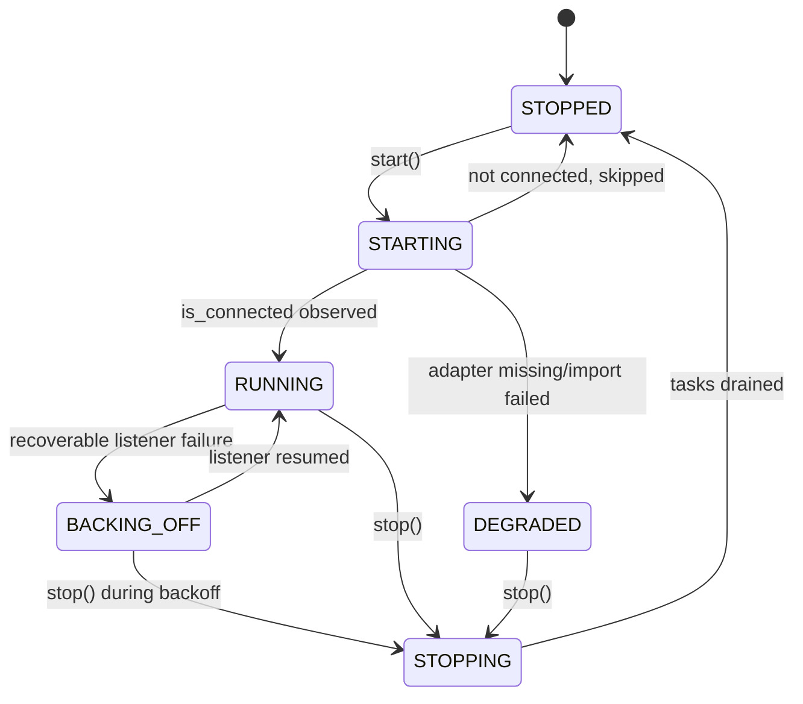

# Messaging channel supervision lifecycle — architecture

Status: **READY FOR IMPLEMENTATION**. Delivery: **BUILDING** (`GRAPHOS-MESSAGING-R001.1` landing in this change). Governing [spec](spec.md).

## Existing system and reuse

`graph_os/messaging/router.py`'s `InboundRouter` already supervises each registered `MessagingBackend` through `_supervise_backend`, with a bounded exponential backoff (`MESSAGING_LISTEN_BACKOFF_BASE_S`/`_MAX_S`/`MESSAGING_LISTEN_HEALTHY_RESET_S`) and a clean `start()`/`stop()` pair that cancels and awaits listener and inbox-reaper tasks. `graph_os/messaging/registry.py`'s `MessagingRegistry.create_backend`/`create_all_enabled` already distinguishes a missing adapter (`ValueError`) from a missing dependency (`ImportError`) and currently only logs and skips it. None of this is exposed as a typed state a caller can read; it lives in log lines and booleans (`_running`, `backend.is_connected`). This spec adds the typed state model those existing code paths report into — it replaces no existing control flow and adds no second supervision loop.

## Architecture

`GRAPHOS-MESSAGING-R001.1` (this change) adds `graph_os/messaging/supervision.py`: a `ChannelSupervisionState` `enum.Enum`, a module-level `_TRANSITIONS` mapping each state to its legal successor set per the diagram above, and a `transition(current, target)` function raising `IllegalSupervisionTransition` (carrying `current`/`target` in its message) on any pair not in that table. This is a pure typed model with no asyncio, no backend import, and no router wiring — the next slice (`GRAPHOS-MESSAGING-R002`) wires `InboundRouter._supervise_backend` and `start()`/`stop()` to call `transition()` and expose a per-backend state read; `GRAPHOS-MESSAGING-R005` wires `MessagingRegistry.create_all_enabled` to record a `DEGRADED` entry instead of only logging. Both remaining slices are `SPECIFIED`, not built in this change.

## Quality and environment

Use `uv sync --extra test`, focused `uv run pytest tests/messaging` (new `tests/messaging/test_supervision.py`), Ruff, and mypy on the changed file. No fixture engine, network, or sibling checkout is required — the state model has no I/O.
