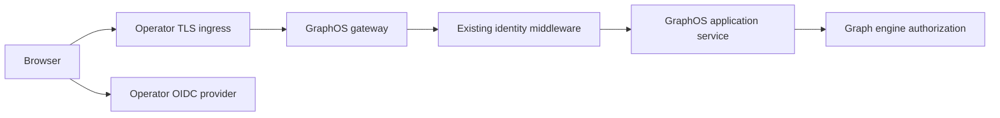

# GRAPHOS-INGRESS — Design and implementation plan

Status: SPECIFIED. Governing [spec](spec.md).

## Existing system and reuse

`graph_os.deployment.genesis_environments.EnvironmentProfile` already has closed `network`, `identity`, `secrets`, `configuration`, `validation`, and `release` sections. `network.ingress_host`, `identity.idp`, `identity.client_secret_ref`, and `secrets.required` are existing entry fields. `graph_os.deployment.config_generator` resolves runtime configuration; `doctor._execution_security_listener` already rejects a non-loopback REST listener without JWKS and exact Host allowlist. `graph_os.gateway.graph_api` installs `ActorIdentityMiddleware` for the served REST path. `graph_os.mcp_server.server` owns the MCP transport path. Extend these components and their existing tests; the remaining gap is an explicit public origin/proxy/callback contract and an integrated served cutover proof.

## Profile and interface contract

Use the existing closed profile loader. Add versioned public-origin, TLS-reference, callback and trusted-proxy fields only where their semantics cannot be represented by the current `network`, `identity`, `secrets`, and `configuration` sections. Fail on unknown keys, HTTP public origin outside loopback, issuer/callback mismatch, untrusted proxy setting, wildcard Host, and missing secret reference. Render a reviewable effective configuration with the canonical origin, exact redirect allowlist, deployment profile digest, and names of secret references; never render secret values. A profile migration must explicitly map old keys to new keys and fail on ambiguous mappings. No implicit domain or IdP default.

The ingress-to-GraphOS contract is HTTPS `Host` plus trusted forwarded scheme/host from a configured proxy identity. The browser callback is an exact registered HTTPS URI under the canonical origin. The IdP provides standards-based discovery/JWKS; GraphOS validates issuer, audience, signature, state, nonce and PKCE through [access control](../identity-access/plan.md). The public API's auth/error contract stays the same whether reached directly or through an ingress.

## Request and deployment path

`setup-config` loads and validates the profile, renders the ingress/application input, and produces a redacted plan. The operator applies its ingress implementation. The GraphOS gateway receives the request through its current `graph_api` route; the existing identity layer builds a verified principal before the application service and engine call. The optional WebUI uses the same public origin and does not implement a second login policy. The post-apply probe performs an authenticated MCP `tools/list` and an unauthorized request; readiness alone is insufficient.

## Security and failure handling

Reject untrusted forwarded headers, mismatched Host/Origin, invalid callback, missing IdP JWKS, missing TLS reference, missing token, tenant mismatch and identity downgrade before effects. Keep a bounded sanitized reason code and correlation ID; avoid echoing auth headers or secret references with sensitive path data. DNS/TLS/IdP availability failure leaves the previous deployment intact or triggers rollback; a dry run must not read credentials. The doctor reports exact missing input keys and the served probe tier actually exercised.

## Cutover and rollback

Model the optional old origin as a separate explicit redirect object with expiry. Require certificate coverage and IdP callback registration for both origins during the window. Allow only safe browser navigation redirect; deny mutation methods, credential-bearing URLs and token responses. At expiry, remove old callback and redirect. Keep principal IDs and graph ownership stable; only the public origin changes. Rollback selects the prior pinned profile and image digest, restores prior DNS/ingress, and reruns authenticated and denied-path probes.

## Quality and release gates

Focused tests run via `uv run pytest` against profile, doctor, gateway and OIDC fixture tests; package checks use `uv build --wheel` and fresh-wheel import. The repository's `docs/quality-gate-terms.md` defines cccc cyclomatic ≤10/cognitive ≤15; `.kiss/kiss.toml` defines KISS limits. Applicable hooks are `complexity-staged`, `complexity-census`, `kiss-staged`, `kiss-census`, `dupehound-changed`, `jscpd-differential`, and `jscpd-census`; the release CI must record exact tool versions and results. Avoid copied ingress validators, duplicated identity middleware and a second profile parser. CI fixtures must provide their own local provider and proxy; hosted DNS/IdP proof is a separate release acceptance receipt.
